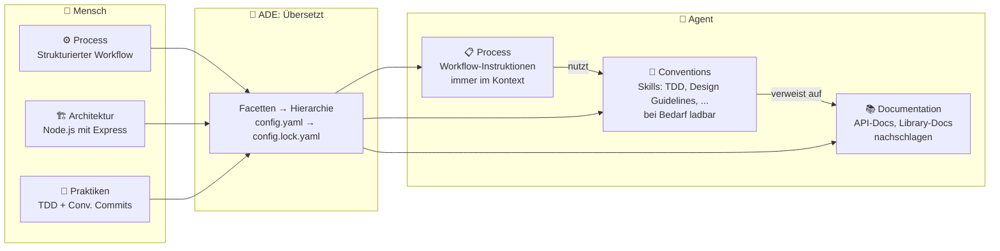
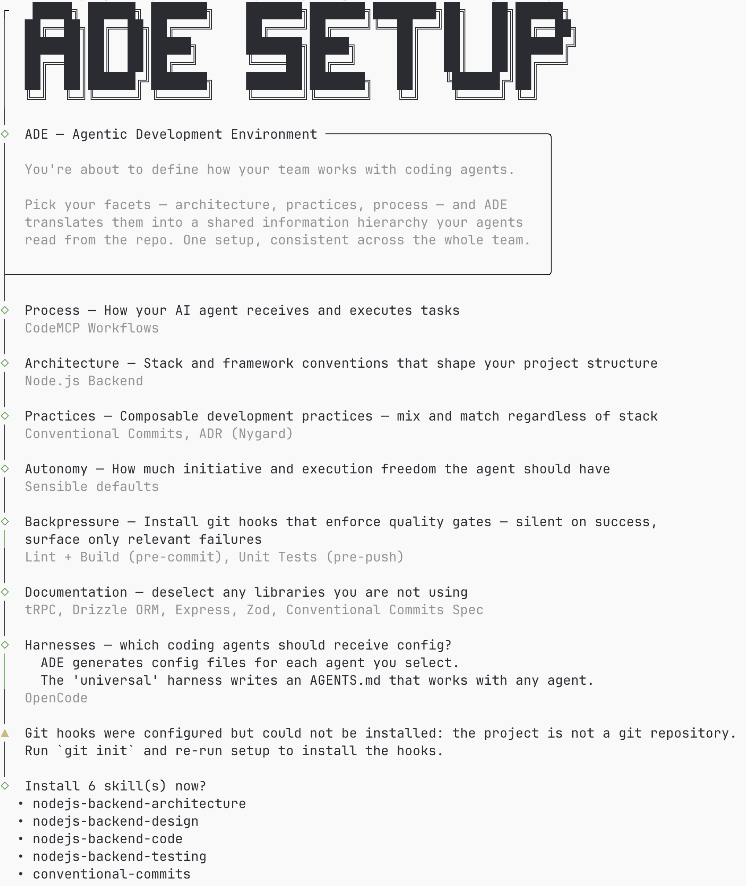
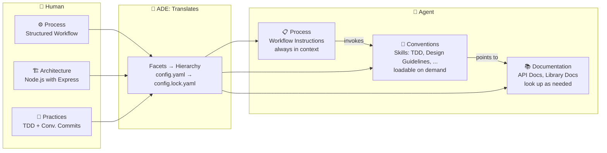

# ADE — Harness Engineering skalieren

> tl;dr: "Menschen denken in Facetten, Agenten brauchen eine Informationshierarchie. ADE übersetzt das eine ins andere — harness-agnostisch, reproduzierbar, und als geteilte Wahrheit im Repo."

## Die offene Frage

Im vorigen Post habe ich argumentiert: Harness Engineering braucht eine Informationshierarchie. **Process → Conventions → Documentation** — so strukturieren Menschen Wissen, und deshalb funktioniert es auch für Agenten.

Aber drei Fragen blieben offen:

- Wie entscheide ich, in welcher Form mir Process, Conventions und Documentation übermittelt wird?
- Wie stelle ich sicher, dass ein ganzes Team dieselbe Hierarchie nutzt?
- Wie mache ich das reproduzierbar — über verschiedene Agents und Harnesses hinweg?

Heute konfiguriert jeder Entwickler seinen Harness individuell. AGENTS.md hier, ein paar Skills dort, MCP-Server nach Geschmack. Das funktioniert für eine Person. Aber es skaliert nicht.

## Das mentale Modell: Facetten statt Hierarchie

Hier ist die entscheidende Beobachtung: **Menschen denken nicht in Informationshierarchien.** Kein Entwickler setzt sich hin und sagt: "Jetzt ordne ich mein Wissen in Process, Conventions und Documentation ein."

Menschen denken in **Facetten** — Aspekte, die ihr Handeln beeinflussen, und für die sie aus Optionen wählen.

Manche Facetten **schließen sich aus**: Welche Architektur nutzen wir? Node.js mit Express _oder_ ein Java-Backend — beides gleichzeitig ergibt keinen Sinn.

Andere Facetten **ergänzen sich**: Welche Praktiken wollen wir? TDD nach London School _und_ Conventional Commits _und_ Architecture Decision Records nach Nygard — alles gleichzeitig, kein Problem.

Aus dieser Zusammenstellung resultieren dann _implizit_ Handlungsweisen und relevante Wissensquellen. Wer Node.js wählt, braucht andere Skills und andere Dokumentation als jemand, der ein Java-Backend baut. Wer TDD praktiziert, braucht einen Skill, der den Workflow beschreibt. Wer ADRs schreibt, braucht ein Template und Konventionen.

Und das kann sich über die Zeit ändern. Ein Projekt, das mit React anfängt und später auf eine neue Version oder sogar ein anderes Framework migriert, braucht andere Konventionen — aber denselben Prozess.

### Der Agent braucht das Gegenteil

Der Agent dagegen kann mit Facetten nichts anfangen. Er braucht eine **klare Hierarchie** mit konkreten Verweisen:

- **Process**: Welchem Workflow folge ich? (Immer im Kontext)
- **Conventions**: Welche Skills stehen mir zur Verfügung? (Bei Bedarf ladbar)
- **Documentation**: Wo finde ich Referenzmaterial? (On-demand abrufbar)

### ADE als Brücke

Genau hier setzt [ADE](https://github.com/codemcp/ade) an — das **Agentic Development Environment**.

ADE übersetzt menschliches Denken in Facetten in eine strukturierte Informationshierarchie für den Agenten. Der Mensch wählt Aspekte und Optionen. ADE weiß, wo sie in der Hierarchie hingehören.

Konkret: Ein Entwickler startet `ade setup` und beantwortet Fragen zu Facetten:

- **Process**: Strukturierter Workflow oder natives AGENTS.md?
- **Architektur**: TanStack, Node.js-Backend oder Java-Backend?
- **Praktiken**: Conventional Commits? TDD? ADRs?
- **Back-Pressure**: Lint/Build bei Commit? Tests bei Push?

Aus diesen Antworten erzeugt ADE die Informationshierarchie: Workflow-Instruktionen als Process, architektur- und praxis-spezifische Skills als Conventions, passende Library-Dokumentation als Documentation.

Der Entwickler muss nicht entscheiden, was Process ist und was Convention. ADE übernimmt dieses Mapping — und hält es konsistent.

## Nudelsuppe bleibt Nudelsuppe

Nun gibt es viele Coding Agents, und jeder Hersteller versucht sich zu differenzieren. Cursor hat Rules, Claude Code hat CLAUDE.md und eine noch mal erweiterte Geschmacksrichtung Skills, Copilot hat Agent-Files, Kiro hat eigene Formate. Von außen sieht das nach fundamental verschiedenen Ansätzen aus.

Aber wie ich immer wieder sage: Letztlich ist der Kontext nur wie Nudelsuppe. Es kommt darauf an, was rein kommt — aber die Struktur ist immer dieselbe: **System-Prompt, Conversation, Tools.** Nicht mehr.

Cursor, Claude Code oder Kiro machen es nur komfortabel, Zutaten zuzugeben. Unterschiedliche Köche, unterschiedliche Rezepte — aber auf der gleichen Kochstelle mit Zutaten der selben Lieferanten zubereitet. Und manchmal im Ergebnis doch überraschend.

_Anmerkung des schreibenden Humanoiden: Ich erinnere mich da an eine kürzlich hergestellte Nudelsuppe, die ob des ungünstigen Verhältnisses von Flüssigkeit und Nudeln eher einem Pudding glich..._

### Das Problem mit Komfort-Magie

Diese Komfort-Magie hat einen Preis: Sie ist **bewusst intransparent**.

Wenn ein Harness meine CLAUDE.md, Skills und Tool-Definitionen zu einem System-Prompt zusammensetzt und auch ohne sie anzuzeigen auswählt, verstehe ich die Inferenz nicht. Ich weiß nicht genau, was der Agent "weiß". Ich kann sein Verhalten schlechter vorhersagen. Und damit zerstört die Magie genau das, was wir eigentlich wollen: **Mental Alignment**.

Deshalb ist eine **harness-agnostische Lösung** so wertvoll. ADE trennt _was der Agent wissen soll_ (die logische Konfiguration, `LogicalConfig`) von _wie ein spezifischer Harness es konsumiert_ (die Harness-Writer). Eine `LogicalConfig`, mehrere Harness-Writer — für Claude Code, Kiro, OpenCode oder welche Latest-Hot-Sh\*t-IDE da noch kommen mag.

Das macht die Konfiguration transparent. Der Mensch kann nachvollziehen, was in den Agent fließt — unabhängig davon, welchen Harness er nutzt.

## Alignment skalieren: Das Vier-Augen-Prinzip

Aber Transparenz für einen einzelnen Entwickler reicht nicht. In der Praxis arbeiten Teams zusammen. Und auch wenn Agenten dazu führen, dass Teams kleiner werden — Alignment wird dadurch **wichtiger**, nicht unwichtiger.

Denn eines ändert sich nicht: **Mit dem Merge in den produktiven Code übernimmt der Mensch die Verantwortung.** Und typischerweise passiert das mit dem Vier-Augen-Prinzip — ein Mensch reviewt, was ein anderer (mit Agent) entwickelt hat.

Wenn diese beiden Menschen unterschiedliche mentale Modelle haben — unterschiedliche Konventionen, unterschiedliche Erwartungen, unterschiedliche Harness-Konfigurationen — dann hakt das Review. Die Fragen häufen sich: "Warum ist das so strukturiert?" "Das widerspricht unserer Architektur." "Welchem Muster folgt das?"

Die Geschwindigkeit, die der Agent gebracht hat, verpufft im Review.

ADE löst das, indem die Konfiguration **im Repo lebt** — nicht in individuellen Dotfiles:

- `config.yaml` hält die gewählten Facetten fest — reviewbar, versioniert
- `config.lock.yaml` enthält die aufgelöste Konfiguration — deterministisch, reproduzierbar
- `ade setup` einmal, `ade install` überall

Das ganze Team arbeitet mit derselben Informationshierarchie. Derselbe Prozess. Dieselben Konventionen. Dieselben Dokumentationsquellen. Nicht weil man es erzwingt — sondern weil es explizit und geteilt ist.

**Shared context over personal configuration.**

## Ausblick

ADE ist [Open Source](https://github.com/codemcp/ade) und am Anfang. Der Katalog wächst, neue Facetten kommen hinzu, die Community kann eigene Optionen und Praktiken beitragen.

Die Grundidee ist einfach: Menschen denken in Facetten. Agenten brauchen eine Hierarchie. ADE übersetzt das eine ins andere — transparent, reproduzierbar und geteilt.

Wenn das für euch interessant klingt: Probiert es aus, gebt Feedback, bringt euch ein. Denn professionelles Engineering ist meist ein Teamsport.

---

# ADE — Scaling Harness Engineering

> tl;dr: "Humans think in facets, agents need an information hierarchy. ADE translates one into the other — harness-agnostic, reproducible, and as a shared truth in the repo."

## The Open Question

In the previous post, I argued: harness engineering needs an information hierarchy. **Process → Conventions → Documentation** — that's how humans structure knowledge, and that's why it works for agents too.

But three questions remained:

- How do I decide in what form process, conventions, and documentation should be delivered to me?
- How do I ensure an entire team uses the same hierarchy?
- How do I make this reproducible — across different agents and harnesses?

Today, every developer configures their harness individually. AGENTS.md here, a few skills there, MCP servers to taste. That works for one person. But it doesn't scale.

## The Mental Model: Facets, Not Hierarchy

Here's the key observation: **Humans don't think in information hierarchies.** No developer sits down and says: "Now I'll organize my knowledge into process, conventions, and documentation."

Humans think in **facets** — aspects that influence how they work, with options to choose from.

Some facets are **mutually exclusive**: What architecture do we use? Node.js with Express _or_ a Java backend — both at once makes no sense.

Other facets are **complementary**: What practices do we want? TDD London School _and_ Conventional Commits _and_ Architecture Decision Records à la Nygard — all at once, no problem.

From this combination, actions and relevant knowledge sources follow _implicitly_. Someone choosing Node.js needs different skills and different documentation than someone building a Java backend. Someone practicing TDD needs a skill describing the workflow. Someone writing ADRs needs a template and conventions.

And this can change over time. A project that starts with React and later migrates to a new version or even a different framework needs different conventions — but the same process.

### The Agent Needs the Opposite

The agent, on the other hand, can't work with facets. It needs a **clear hierarchy** with concrete references:

- **Process**: What workflow do I follow? (Always in context)
- **Conventions**: What skills are available to me? (Loadable on demand)
- **Documentation**: Where do I find reference material? (Retrievable on demand)

### ADE as a Bridge

This is exactly where [ADE](https://github.com/codemcp/ade) comes in — the **Agentic Development Environment**.

ADE translates human thinking in facets into a structured information hierarchy for the agent. The human selects aspects and options. ADE knows where they belong in the hierarchy.

Concretely: a developer runs `ade setup` and answers questions about facets:

- **Process**: Structured workflow or native AGENTS.md?
- **Architecture**: TanStack, Node.js backend, or Java backend?
- **Practices**: Conventional Commits? TDD? ADRs?
- **Back-pressure**: Lint/build on commit? Tests on push?

From these answers, ADE generates the information hierarchy: workflow instructions as process, architecture- and practice-specific skills as conventions, matching library documentation as documentation.

The developer doesn't need to decide what's process and what's convention. ADE handles this mapping — and keeps it consistent.

## Noodle Soup Remains Noodle Soup

Now, there are many coding agents, and every vendor tries to differentiate. Cursor has Rules, Claude Code has CLAUDE.md and its own extended flavor of skills, Copilot has Agent Files, Kiro has its own formats. From the outside, these look like fundamentally different approaches.

But as I keep saying: ultimately, context is just like noodle soup. What matters is what goes in — but the structure is always the same: **system prompt, conversation, tools.** Nothing more.

Cursor, Claude Code, or Kiro just make it convenient to add ingredients. Different chefs, different recipes — but cooked on the same stove with ingredients from the same suppliers. And sometimes the result is still surprising.

_Note from the writing humanoid: I recall a recently prepared noodle soup where the unfortunate ratio of liquid to noodles made it resemble a pudding more than anything..._

### The Problem with Convenience Magic

This convenience magic comes at a price: it's **deliberately opaque**.

When a harness assembles my CLAUDE.md, skills, and tool definitions into a system prompt — and selects among them without showing me — I can't understand the inference. I don't know exactly what the agent "knows." I can't predict its behavior as well. And that magic destroys exactly what we actually want: **mental alignment**.

That's why a **harness-agnostic solution** is so valuable. ADE separates _what the agent should know_ (the logical configuration, `LogicalConfig`) from _how a specific harness consumes it_ (the harness writers). One `LogicalConfig`, multiple harness writers — for Claude Code, Kiro, OpenCode, or whatever latest-hot-sh\*t IDE may come along.

This makes the configuration transparent. The human can trace what flows into the agent — regardless of which harness they use.

## Scaling Alignment: The Four-Eyes Principle

But transparency for a single developer isn't enough. In practice, teams work together. And even though agents are making teams smaller — alignment becomes **more important**, not less.

Because one thing doesn't change: **When code is merged into production, the human takes responsibility.** And typically, this happens with the four-eyes principle — one human reviews what another (with an agent) has developed.

If these two humans have different mental models — different conventions, different expectations, different harness configurations — the review stalls. Questions pile up: "Why is this structured this way?" "This contradicts our architecture." "What pattern does this follow?"

The speed that the agent delivered evaporates in the review.

ADE solves this by keeping the configuration **in the repo** — not in individual dotfiles:

- `config.yaml` records the chosen facets — reviewable, versioned
- `config.lock.yaml` contains the resolved configuration — deterministic, reproducible
- `ade setup` once, `ade install` everywhere

The entire team works with the same information hierarchy. Same process. Same conventions. Same documentation sources. Not because it's enforced — but because it's explicit and shared.

**Shared context over personal configuration.**

## Outlook

ADE is [open source](https://github.com/codemcp/ade) and just getting started. The catalog is growing, new facets are being added, and the community can contribute their own options and practices.

The core idea is simple: humans think in facets. Agents need a hierarchy. ADE translates one into the other — transparently, reproducibly, and as a shared resource.

If this sounds interesting: try it out, give feedback, get involved. Because professional engineering is usually a team sport.
