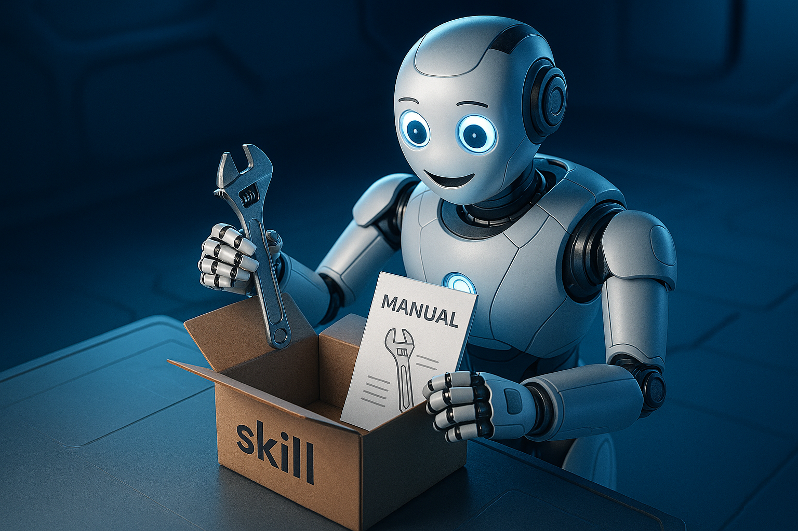
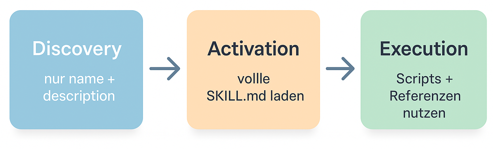

# Agent Skills – Fähigkeiten in handlichem Paket



> tl;dr: "Skills sind ein leichtgewichtiger, offener Standard, um Agent-Fähigkeiten paketiert zu teilen. Durch Progressive Disclosure bleiben sie effizient, durch Modularität mächtig. Konzeptionell brillant - aber mit praktischen Herausforderungen."

In der Interaktion mit Agenten geht alles um den Kontext. Das wissen wir alle.

Wie ich schon in [Context is all you need](/blog/context-is-all-you-need) schrieb: Context Engineering ist die Kunst, dem LLM die Informationen zur richtigen Zeit zu geben. Es gibt hier keine geheime Zutat, es ist alles nur Nudelsuppe, wie auch Poe in Kung-Fu Panda lernt. Es geht nur darum, wann man was rein wirft.

Aber eine Frage hatte ich dort nicht beantwortet: **Wie mache ich wertvollen Kontext wiederverwendbar?**

Stell dir vor: Du bringst einem Agenten mühsam bei, wie man professionelle PowerPoint-Präsentationen erstellt. Der Agent lernt das Layout, die Formatierung, die Best Practices. Nach zwei Stunden Iterationen funktioniert es perfekt.

Am nächsten Tag sitzt dein Kollege am Schreibtisch. Anderer Agent, gleiche Aufgabe. Und der Agent? **Fängt bei Null an.**

Das ist, als würde jeder Koch in einem Restaurant täglich neu herausfinden müssen, wie man Nudelsuppe kocht. Funktioniert. Aber ineffizient.

Klar, es gibt [Prompts](/blog/prompts-als-code). Die kann man parametrisieren, versionieren, wiederverwenden. Aber der **Anwender muss sie selbst auswählen** - der Agent weiß nicht, welcher Prompt gerade passt. Und Prompts sind nur Text, keine Möglichkeit, Tools zu paketieren, die ihre Fähigkeiten erweitern.

Offen blieb bisher die Antwort zum Gedanken **Was, wenn Agenten Fähigkeiten wie Module importieren könnten - und selbst entscheiden, wann sie welche brauchen?**

## Das Problem: Die Trade-offs bisheriger Ansätze

Wenn du heute einem Agenten neue Fähigkeiten geben willst, hast du verschiedene Optionen. Aber alle haben Trade-offs.

### MCP Remote Server: Mächtig, aber schwergewichtig

Das Model Context Protocol (MCP) ist fantastisch für Tools. Du baust einen Server, der Agent verbindet sich, bekommt neue Werkzeuge.

**Das Problem:** Remote Server bedeuten:

- Separate Server-Prozesse
- Deployment-Overhead
- Infrastruktur-Management
- Nicht trivial für schnelles Prototyping

Für Enterprise-Setups perfekt. Für "Hey, ich möchte meinem Agenten beibringen, wie wir im Team Code reviewen"? Overkill.

### MCP STDIO Server: Leichtgewichtig im Deployment, aber...

STDIO-basierte MCP Server sind besser - sie laufen lokal, kein separater Prozess nötig.

**Das Problem:** Der MCP-Kontrakt ist umfangreich:

- Server-Implementierung schreiben
- Protocol Handling
- Error Management
- Nicht mal eben in 10 Minuten gemacht

Leichtgewichtig im **Deployment**, aber nicht leichtgewichtig in der **Bereitstellung**.

### MCP Tools: Nur ein Aspekt

MCP Tools sind großartig für einzelne Funktionen. Aber sie sind genau das: **Tools**. Nicht modulares, paketiertes Wissen.

Du kannst einem Agenten ein Tool geben, das PDFs liest. Aber nicht ein vollständiges "wie verarbeite ich PDFs professionell"-Paket mit Instructions, Beispielen, Scripts und Referenzen.

### Prompts: Leichtgewichtig, aber limitiert

Wie ich in [Prompts als Code](/blog/prompts-als-code) beschrieb: Prompts sind wiederverwendbare Anweisungen. Aber sie sind nur **Text**. Keine Scripts, keine Assets, keine modulare Paketierung.

### Copy-Paste: Das Anti-Pattern

Und dann gibt es natürlich Copy-Paste. "Hey, benutze diese Instructions für Code Reviews." Funktioniert. Aber:

- Keine Versionierung
- Team-Konventionen gehen verloren
- Jeder macht es anders
- Iterative Verbesserung? Vergiss es.

### Was fehlt?

Was wir wirklich brauchen:

- **Leichtgewichtig** wie Prompts
- **Einfach bereitzustellen** (keine komplexe Server-Implementierung)
- **Modular** (Instructions + Scripts + Assets zusammen paketiert)
- **Versionierbar** (Git, nicht Chat-Historie)
- **Team-fähig** (Konventionen teilen)

Genau hier kommen **Agent Skills** ins Spiel.

## Die Lösung: Agent Skills

Agent Skills sind - konzeptionell betrachtet - genau diese Ideal-Lösung: Nicht zu schwer, nicht zu leicht. Genau richtig.

### Was sind Skills?

Ein Skill ist ein **Ordner mit einer `SKILL.md` Datei**. Das war's. Kein Server. Keine Infrastruktur. Nur Dateien.

**Beispiel:** Der [PowerPoint-Skill von Anthropic](https://github.com/anthropics/skills/tree/main/skills/pptx)

```
skills/pptx/
├── SKILL.md              # Instructions + Metadata
├── scripts/              # Python/Shell Scripts
├── editing.md            # Referenzen
├── pptxgenjs.md          # Dokumentation
└── LICENSE.txt
```

Die `SKILL.md` enthält YAML-Frontmatter und Markdown:

```markdown
---
name: powerpoint-expert
description: Create professional PowerPoint presentations with proper layouts and formatting
---

# PowerPoint Expert Skill

## When to use this skill

Use this skill when the user needs to create, modify, or review PowerPoint presentations...

## How to create a presentation

1. Start with the template in references/design-guide.md
2. Use scripts/create_pptx.py for programmatic generation
3. Follow our team's layout conventions...
```

Das ist alles. Einfach. Deklarativ. Portabel.

### Progressive Disclosure: Der Kern-Vorteil

Hier wird es interessant. Skills nutzen **Progressive Disclosure** - und das ist ihr größter Vorteil gegenüber MCP Tools.

**Wie es funktioniert:**



1. **Discovery Phase**: Beim Start lädt der Agent nur `name` und `description` aller verfügbaren Skills
   - Minimaler Context Footprint
   - Der Agent "weiß", welche Skills existieren
   - Aber lädt noch nicht die vollen Instructions

2. **Activation Phase**: Wenn eine Aufgabe zu einem Skill passt, lädt der Agent die volle `SKILL.md`
   - Jetzt bekommt der Agent die detaillierten Instructions
   - Plus Zugriff auf Scripts und Referenzen
   - Context wächst nur bei Bedarf

3. **Execution Phase**: Der Agent nutzt die Instructions und führt optional Scripts aus
   - Kann Scripts aufrufen (`scripts/create_pptx.py`)
   - Kann Referenzen lesen (`editing.md`, `pptxgenjs.md`)
   - Kann Assets nutzen

**Das ist fundamental anders als MCP Tools:**

Mit MCP Tools bekommt der Agent alle Tool-Definitionen auf einmal. Mit Skills bekommt er nur die Namen - und lädt Details on-demand.

Bei 50 Skills bedeutet das:

- **Mit MCP:** 50 komplette Tool-Definitionen im Context
- **Mit Skills:** 50 kurze Beschreibungen → Eine volle Skill-Anleitung bei Bedarf

Das ist **Context-effizient**.

## Mehr als nur Context

Skills sind nicht nur ein cleveres Context-Engineering-Tool. Sie sind **paketiertes, wiederverwendbares Wissen**.

Der Skill liegt im Git-Repo. Versioniert. Reviewbar. "**Wir** machen Code Reviews so" statt "**Ich** mache Code Reviews so."

Und ja: Skills bringen **neue Zutaten** zur Nudelsuppe:

- **Scripts:** Nicht nur "erkläre, wie es geht", sondern "führe aus"
- **Modulare Prompts:** Instructions in verdaulichen Häppchen
- **Assets:** Templates, Beispiele, Referenzen - zusammen paketiert

## Konzeptionelle Einordnung

Skills sind konzeptionell etwas Neues in der Landschaft des Context-Engineering.

In meinen früheren Posts habe ich über Tools geschrieben, die **vorhandenen Context managen**:

- [responsible-vibe-mcp](https://github.com/mrsimpson/responsible-vibe-mcp): Prozess-Struktur & phasenspezifischer Context
- [agentic-knowledge-mcp](https://github.com/mrsimpson/agentic-knowledge-mcp): Intelligente Navigation durch Dokumentation
- [quiet-shell-mcp](https://github.com/mrsimpson/quiet-shell-mcp): Noise-Filtering bei Command-Output

**Skills sind anders:**

Skills **bringen nicht nur modulare Prompts**, sondern ganze **Fähigkeiten**.

Sie sind nicht nur ein weiteres Tool zur Context-Optimierung. Sie sind ein konzeptioneller Ansatz für **wiederverwendbares Agent-Wissen**.

Und das Beste: **Das Format ist offen.**

Initiiert von Anthropic, aber als [offener Standard](https://agentskills.io) veröffentlicht. Die Community kann beitragen, erweitern, eigene Skills bauen. Skills sind keine proprietäre Lösung, sondern ein **offenes Ökosystem**, das auch in autonomen Werkzeugen (wie bspw. OpenClaw) eine große Anwendung findet.

## Die Realität: Das Teilen ist die Schwäche

Soweit die Theorie. Konzeptionell sind Skills echt cool.

Die Praxis? **Client-Abhängigkeit.**

Skills müssen in **client-spezifische Ordner** installiert werden:

- Cursor: `~/.cursor/skills/`
- Claude Desktop: `~/.claude/skills/`
- VSCode: `.vscode/skills/`

Dein Team nutzt unterschiedliche Clients? Wo leben die Team-Skills? Wie werden sie synchronisiert?

Das **konzeptionelle Versprechen** ("portabel, wiederverwendbar") trifft auf eine **praktische Hürde**, nämlich eine client-spezifische Installation.

### Progressive Disclosure, anders gedacht

Ich fragte mich also: Kann man Progressive Disclosure nicht auch **anders** implementieren und dabei den mächtigen Standard nutzen?

Letztlich müssen die `descriptions` doch nur irgendwie in den Kontext - und dann bei Bedarf "verlängert" werden mit den vollen Instructions. Da geht doch was.

Und wenn man das schon neu denkt, kann man dabei auch gleich die Team-Sharing-Schwäche angehen...

Aber das ist Teil des nächsten Posts. #cliffhanger

## Fazit: Handliches Paket, praktische Hürde

Am Ende ist alles Nudelsuppe. Aber mit den **richtigen Zutaten** (Skills: Instructions + Scripts + Assets) und der **richtigen Zubereitung** (Progressive Disclosure) wird es eine gute Suppe.

Skills sind konzeptionell brillant: Leichtgewichtig, modular, portabel.

Die Client-Abhängigkeit ist real. Aber lösbar.

**Links:**

- [Skills-Spezifikation](https://agentskills.io)
- [Beispiel-Skills](https://github.com/anthropics/skills)

Im nächsten Post zeige ich, wie man Progressive Disclosure anders implementieren kann - und dabei gleich das Team-Sharing-Problem löst.

---

**Frage an dich:** Nutzt du Skills? Wie teilst du Agent-Wissen im Team? Ich freue mich auf den Austausch!
