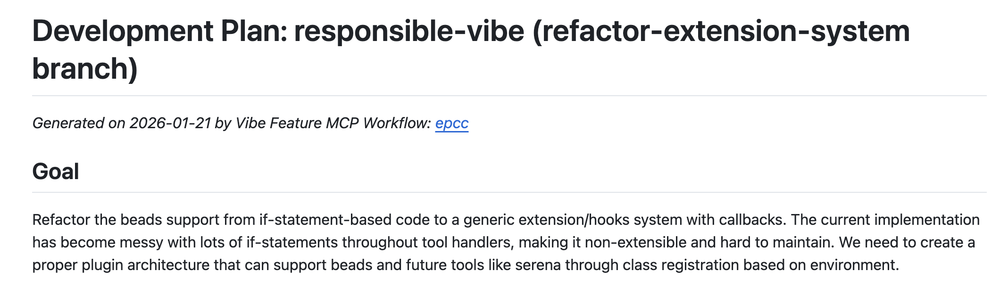
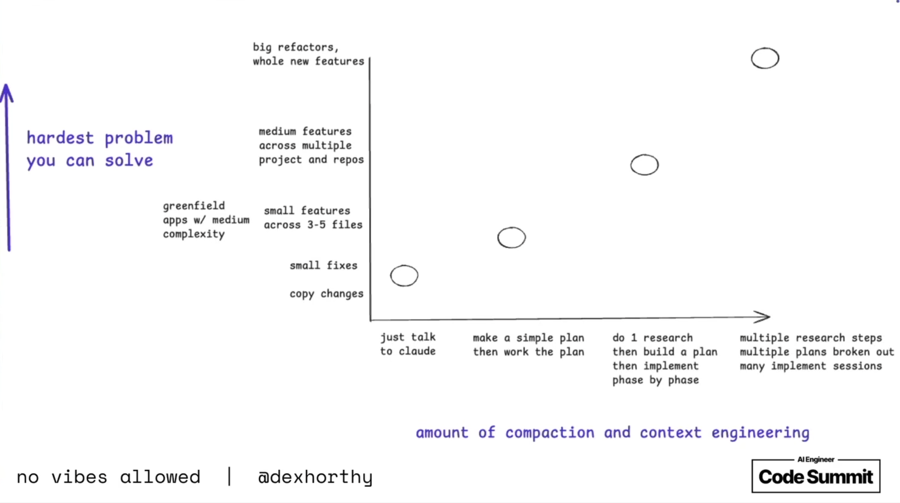

# Warum dein Agent nicht versteht, was du wirklich brauchst

Ein Nutzer fragte mich kürzlich: "Sollen wir Responsible Vibe für diese Aufgabe einsetzen?"

Er hatte gerade Claude Opus 4.6 getestet und war begeistert, wie gut es "out of the box" funktionierte. Claude's Antwort war pragmatisch:

> "Responsible Vibe? Honestly, it's process overhead. I'd say skip it – we know what we need to do."

Claude hatte einen Punkt. Die Aufgabe schien klar. Der Prozess-Overhead echt. Die schnelle Umsetzung ohne Ritual möglich.

Und trotzdem war hier etwas fundamental schief. Aber nicht mit dem Agenten.

## Manchmal sind wir selbst nicht klar genug

Ok, das geben wir nicht gerne zu. Aber: **Die meisten von uns können ihre eigene Intention nicht immer klar beschreiben.** Nicht weil wir dumm sind. Sondern weil wir zu Lösungen springen, bevor wir unsere tieferen Ziele verstanden haben.

Auch zwischenmenschlich führt das zu Reibung – wie oft hatten wir Diskussionen, die sich im Kreis drehten, weil niemand klar sagte, was das eigentliche Ziel war?

Mit Agenten ist es nicht anders. Der Agent sieht: "Task ist klar, lass mich starten." Aber was bedeutet "klar genug"? Für den Agenten? Für die Zukunft? Für die nächste Person, die den Code anfasst?

## Aktuelles Beispiel: Das Plugin-System in Responsible-Vibe-MCP selbst

Ich arbeite an responsible-vibe-mcp und brauchte irgendwann Unterstützung für **beads** – einen Task-Manager, der ideal zu responsible-vibe passt.

Zuerst war das einfach: `if (taskBackend === 'beads') { ... }`

Der Code war gespickt mit beads-Checks:

```typescript
if (taskBackend === "beads") {
  await setupBeadsIntegration();
}
// In einer anderen Funktion:
if (taskBackend === "beads") {
  await validateBeadsTask();
}
// Und noch einer:
if (taskBackend === "beads") {
  return new BeadsPlanManager();
}
```

**Das "funktionierte".** Tests grün. Beads funktionierte.

Aber jeder, der schon mal selbst ernsthaft Software gebaut hatte und der den Code las, sah: Ein Produkt, das sich selbst im Weg steht.

### Was passiert, wenn du nur "refactor" sagst

Wenn ich zu Agenten sagte "refactor this", passierte etwas Interessantes. Sie machten es "sauberer": mehr Methoden, bessere Namen, weniger Zeilen pro Funktion.

Der Code sah besser aus. Aber er **adressierte nicht das echte Problem.**

Das echte Problem war: Sobald die nächste Integration kommt, würde die Komplexität explodieren. If-Statements an fünf verschiedenen Orten. Wartbarkeit? Niemals.

### Die alte Weisheit: Warum, nicht Was

Es ist wie mit Kommentaren im Code. Die guten Entwickler wissen seit Jahrzehnten: Schreib nicht, _was_ hier passiert – das sieht man am Code. Schreib, _warum_ es so passiert.

Dasselbe gilt für Agenten: Sag nicht nur, _was_ du willst. Sag, _warum_ du es willst.

In meinem Fall war das Warum: Der Kern meiner Anwendung darf **null Ahnung** von spezifischen Integrationen haben. Er sollte nur Lifecycle-Events anbieten. Wer sich dafür interessiert, kann sich registrieren.

Das war die echte Intention. Nicht "mach den Code sauberer". Sondern "baue die Anwendung so, dass neue Integrationen möglich sind, ohne den Kern zu verändern."

Daraus wurde ein Plugin-System mit Lifecycle Hooks. Der Kern bleibt unwissend, Plugins reagieren auf Events.

**Der Unterschied:** Hätte ich nur gesagt "refactor this", wäre der Code sauberer geworden – aber die Architektur wäre dieselbe geblieben. Mit der richtigen Intention ging der Agent direkt zum Plugin-System.

## "Alignment"

Die Hararisti unter euch haben es sicher schon gemerkt: Es geht um das Angleichen von Intentionen. Yuval Noah Harari nennt das in **Nexus** "Alignment": Stimmen die Ziele eines Systems mit den Zielen einer Gesellschaft/eines Individuums überein?

Und dann stellt sich ein bekanntes Problem, zu dem es auch bekannte Lösungsideen gibt:

**Alignment funktioniert nicht durch Kontrolle. Alignment funktioniert durch eine gleiche Informationsbasis** (und gemeinsame Werte, aber das lassen wir hier mal weg, sonst wird es zu philosophisch).

Im Kontext des Alignments mit KI-Agenten heißt "Information = Kontext".

Ein Agent kann nur mit den Informationen arbeiten, die du ihm gibst. Wenn du sagst "Refactor diesen Code" ohne "Die Intention ist ein Plugin-System", bekommst du sauberen Code. Nicht ein Plugin-System.

Das ist nicht böswillig. Das ist Ergebnis einer Funktion: Unklarer Input → unpräziser Output.

### Responsible Vibe ist nicht für den Agenten

Wenn ich "responsible-vibe für Alignment" sage, denken die meisten: _"Damit kontrolliere ich den Agenten."_

Aber das stimmt so nur zum Teil.

**responsible-vibe ist nicht primär für den Agenten. Es ist für dich selbst.**

Der Prozess zwingt dich zu Fragen:

- **Goal**: Was willst du _wirklich_ erreichen? Nicht nur das Was – sondern: Warum?
- **Discovery**: Bevor du startest – was sind deine echten Anforderungen?
- **Decisions**: Welche Alternativen hast du verworfen? Warum?

Mit jedem Schritt wirst _du_ klarer. Der Agent wird aligned, weil du selbst klarer wirst.



## Die Alignment-Pyramide: Operativ, Taktisch, Strategisch

Clausewitz beschrieb Kriegführung in drei Ebenen: **operativ** (die einzelne Schlacht), **taktisch** (wie Schlachten zusammenwirken), **strategisch** (das übergeordnete Ziel).

Diese Pyramide gilt auch für Agent-Arbeit:

- **Operativ**: Der Agent schreibt gerade eine Funktion
- **Taktisch**: Diese Funktion ist Teil eines Refactorings
- **Strategisch**: Das Refactoring dient einer Plugin-Architektur

Ein Agent, der nur die operative Ebene sieht, optimiert auf "saubere Funktion". Er kann gar nicht wissen, dass du strategisch ein Plugin-System brauchst – es sei denn, du sagst es ihm.

Harari beschreibt etwas Weiteres über Systeme, das hier relevant ist: Sie können hochperformant sein und dabei die völlig falschen Ziele verfolgen. Und das Schlimmste: Sie merken es selbst nicht.

**Ein suboptimaler Output vom Agenten ist oft kein Zeichen, dass der Agent schlecht ist. Es kann ein Zeichen sein, dass die Intention nicht klar genug kommuniziert wurde.**

## Die echte Antwort auf Claudes Frage

Dex Horthy hat in seinem Talk ["No Vibes Allowed"](https://www.youtube.com/watch?v=rmvDxxNubIg) einen wichtigen Punkt gemacht: **Mental Alignment** ist die Basis für guten Code. Bevor du den Agenten losschickst, musst du selbst verstanden haben, was du eigentlich willst.

Aber – und das ist genauso wichtig – Horthy sagt auch: "Small fixes? Just talk to Claude." Nicht jede Aufgabe braucht einen Plan. Ein Typo-Fix braucht keine Discovery-Phase.



Die Frage ist nicht "Prozess oder kein Prozess?" Die Frage ist: **Wie komplex ist meine eigene Intention?**

- Kleiner Fix, klare Änderung → Direkt loslegen
- Größeres Feature, unklare Anforderungen → Plan machen, vielleicht Recherche am Anfang
- Architektur-Entscheidung → Definitiv erst denken, dann coden.

responsible-vibe ist kein Overhead, wenn du es als das siehst, was es ist: Ein Werkzeug zur **Selbstklärung** bei komplexeren Aufgaben. Nicht zur Agent-Kontrolle bei jedem Einzeiler.

## Die befreiende Erkenntnis

Wenn dein Agent nicht das liefert, was du dir vorgestellt hast, lohnt sich die Frage: War meine Intention klar genug?

Das ist keine Schuldzuweisung. Es ist eine Chance. Denn wenn die Lösung bei dir liegt, kannst du auch etwas tun.

Ein Agent kann nicht evaluieren, was er nicht wissen kann. **Aber du kannst dir selbst klarer werden.**

---

Ich stelle mir vor, wie du responsible-vibe das nächste Mal nutzt. Eine ähnliche Frage kommt auf: "Ist das nicht Overhead?"

Und du antwortest: "Vielleicht. Aber es hilft mir, klarer zu werden über das, was ich wirklich brauche. Und das ist kein Overhead – das ist der eigentliche Job."

Das ist die passende Antwort.
