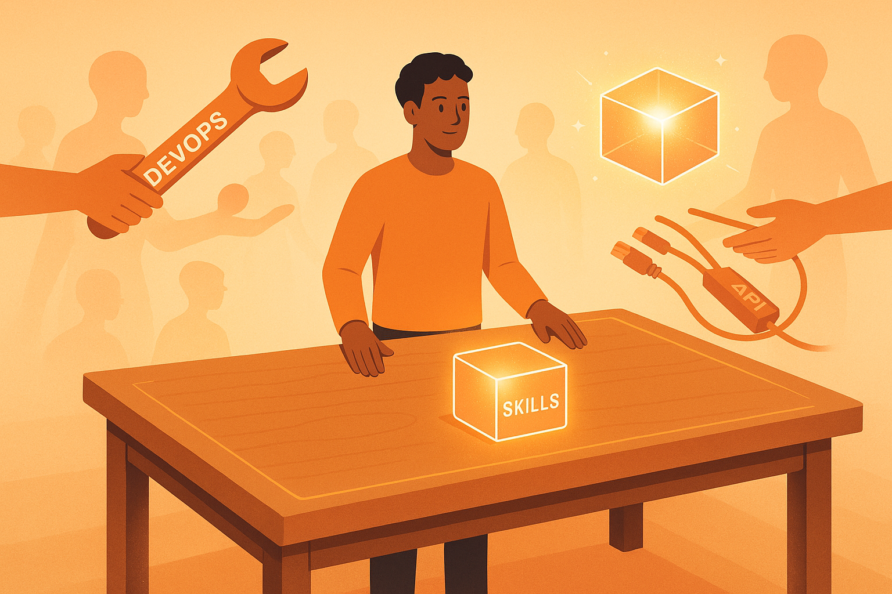
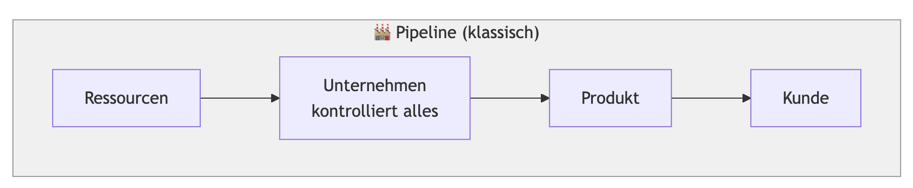
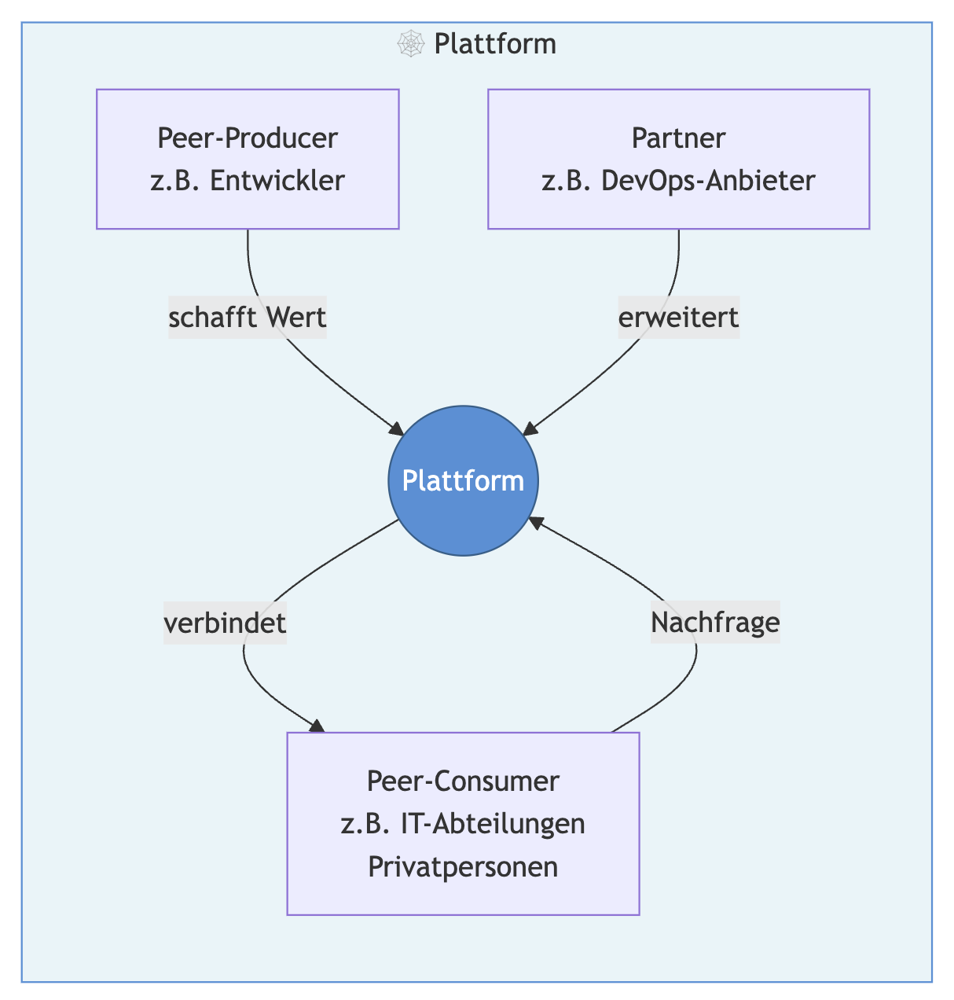

# Claude Code als Plattform – Was Plattform-Ökonomie über die Zukunft der Software-Entwicklung verrät

> tl;dr: "Claude Code ist nicht einfach ein besseres Coding-Tool. Betrachtet man es durch die Brille der Plattform-Ökonomie, erkennt man: Anthropic baut keinen besseren Hammer – es baut eine Werkbank. Entwickler werden zu Peer-Producern, DevOps-Anbieter zu Partnern, und Skills zum Marktplatz-Mechanismus. Die Parallelen zu Uber, Airbnb und Shopify sind frappierend – aber Software ist speziell."

Ich beobachte seit Monaten, wie sich die Software-Industrie unter dem Einfluss von KI verändert. Alle reden über Agenten, die Entwickler ersetzen. Über Produktivitätssteigerungen. Über das Ende des Programmierens, wie wir es kennen.

Aber irgendwas stimmte nicht an diesem Narrativ. Es griff zu kurz. Was da passiert, ist keine einfache Automatisierung. Es ist etwas Strukturelleres.

Beim Joggen rannten auch die Gedanken und ich erinnerte mich an einen Workshop, den ich vor langer Zeit besucht hatte: das [Platform Design Toolkit](https://boundaryless.io/pdt-toolkit/) von [Simone Cicero](https://www.linkedin.com/in/simonecicero/), [Luca Ruggeri](https://www.linkedin.com/in/ruggeriluca/) und ihrem Team. Auch Jahre danach und ohne dass ich viel mit Plattform-Ökonomie zu tun habe, resoniert er noch immer.

Und plötzlich fielen die Puzzleteile zusammen.

**Anthropic baut keinen besseren Hammer. Es baut eine Werkbank.**

## Was macht eine Plattform zur Plattform?

Bevor wir Claude Code unter die Lupe nehmen, kurz die Basics – für alle, die sich nicht täglich mit Plattform-Ökonomie beschäftigen.

Der Kern: Ein klassisches Unternehmen (eine "Pipeline") kontrolliert die gesamte Wertschöpfung. Es kauft Rohstoffe, produziert, verkauft. Der Wert entsteht *innerhalb* der Organisation.

Eine **Plattform** funktioniert fundamental anders. Sie kontrolliert nicht die Produktion – sie **ermöglicht Interaktionen** zwischen externen Akteuren. Der Wert entsteht *im Ökosystem*, nicht im Unternehmen selbst.

Das Platform Design Toolkit beschreibt drei Value Propositions, die jede erfolgreiche Plattform kombiniert:

1. **Produkt**: Das Kernprodukt, das Nutzer auch *ohne* das Ökosystem verwenden können – der "Single-Player-Mode". Bisher war das typischerweise Software-as-a-Service (SaaS).
2. **Extension Platform**: Schnittstellen, über die Dritte das Produkt erweitern können
3. **Marketplace**: Ein Marktplatz, auf dem Anbieter und Nachfrager zusammenfinden

Shopify ist das Lehrbuch-Beispiel: Das Kernprodukt ist der Online-Shop-Baukasten (SaaS). Der App Store lässt Dritte das Produkt erweitern (Extension Platform). Und der Experten-Marktplatz verbindet Händler mit Spezialisten (Marketplace).

Warum ist das relevant? Weil Claude Code exakt dieser Trajectory folgt.

## Claude Code durch die Plattform-Brille

Setzen wir die Plattform-Brille auf und schauen uns an, was Anthropic da eigentlich baut:

### Das Produkt: Claude Code als "Single-Player-Mode"

Claude Code ist zunächst ein mächtiges Coding-Tool. Ein KI-Agent, der Code schreibt, debuggt, refactored, Tests ausführt. Man braucht kein Ökosystem drum herum – es funktioniert sofort. Das ist der klassische **Single-Player-Mode**, mit dem Plattformen ihre erste Nutzerbasis aufbauen: Ein Produkt, das für sich allein steht.

Shopify startete genauso: Erst ein brauchbarer Online-Shop, *dann* der App Store.

### Die Extension Platform: MCP als offene Schnittstelle

Mit dem [Model Context Protocol (MCP)](https://modelcontextprotocol.io/) hat Anthropic eine offene Schnittstelle geschaffen, über die Dritte Claude Code erweitern können. Supabase, DigitalOcean, Grafana Cloud, AWS, Google Cloud – sie alle können MCP-Server bereitstellen, die Claude Code neue Fähigkeiten geben.

Das ist die Extension Platform: Claude Code wird erweiterbar, ohne dass Anthropic selbst jede Integration bauen muss.

### Der Marketplace: Skills als Handelsware

Und dann sind da die [Skills](/blog/agent-skills-wiederverwendbares-wissen). Leichtgewichtige Pakete aus Instruktionen, Scripts und Assets, die Expertise bündelbar und teilbar machen. Ein DevOps-Experte kann sein Wissen über Kubernetes-Deployments als Skill paketieren. Ein Frontend-Spezialist sein Wissen über barrierefreie UI-Komponenten.

Skills sind der Marktplatz-Mechanismus: Sie standardisieren die "Transaktion" zwischen dem, der Expertise hat, und dem, der sie braucht.

### Und wer sind die Akteure?

Jede Plattform braucht klar definierte Rollen. Im PDT-Framework:

- **Plattform-Anbieter**: Anthropic – baut und betreibt Claude Code
- **Peer-Producer**: Software-Entwickler – sie erzeugen den eigentlichen Wert: Software
- **Partner**: Cloud- und DevOps-Anbieter – sie erweitern die Plattform mit Infrastruktur-Skills und MCP-Servern
- **Peer-Consumer**: Und hier wird es spannend.

Denn wer *konsumiert* eigentlich auf dieser Plattform?

Ich sage es immer öfter: **It's the age of personal software.** Unser Leben findet zunehmend digital statt. Software ist der Treiber. Und wenn die Hürden zur Software-Erstellung radikal sinken, wird *jeder* zum potenziellen Peer-Consumer – jeder, der ein Problem hat, das Software lösen kann.

Daneben gibt es die fachlichen IT-Abteilungen in Unternehmen. Ob sie ihre Bedürfnisse künftig über klassische IT-Dienstleister decken oder im Self-Service über Plattformen wie Claude Code – das ist eine der offenen Fragen, die mich am meisten umtreiben.

Der Entwickler hat dabei eine interessante **Doppelrolle**: Er ist gleichzeitig Peer-Producer (er schafft Software) und Peer-Consumer (er nutzt Skills und MCP-Server). Bei Airbnb ist das eindeutig getrennt – Host und Gast. Im Fall von Software-Erzeugung verschwimmt die Grenze.

## Der Long Tail: Jede SAP-Installation ist eine Schneeflocke

Ein Kernkonzept der Plattform-Ökonomie ist der **Long Tail**: Plattformen adressieren nicht nur die großen Märkte, sondern ermöglichen es, viele kleine Nischen wirtschaftlich zu bedienen. Je niedriger die Transaktionskosten, desto kleiner die Nische, die noch tragfähig ist.

Und hier liegt massives Potenzial.

Denn seien wir ehrlich: **Jede SAP-Installation ist eine Schneeflocke.** Theoretisch Standardsoftware, praktisch individuell bis zur Unkenntlichkeit customized. Jede anders. Jede ein Unikat. Damit verdienen SAP und Co. ihr Geld: Sie sind im Kern Low-Code-Plattformen zur Individualisierung.

Das gilt nicht nur für SAP. Es gilt für fast jede Enterprise-Software. Und es gilt erst recht für die unzähligen internen Tools, Workflows und Automatisierungen, die in jeder Organisation existieren – oder existieren *sollten*, aber nie gebaut wurden, weil die Transaktionskosten zu hoch waren.

Claude Code + Skills senken diese Transaktionskosten radikal. Von "einen DevOps-Berater engagieren" zu "einen Skill installieren". Von "ein Projekt aufsetzen" zu "eine Instruktion laden". Der Long Tail der Software-Individualisierung wird plötzlich adressierbar.

## Die Monetarisierung: Tokens statt Take-Rate

Hier wird es richtig interessant – und hier bricht die Analogie zu klassischen Plattformen am deutlichsten.

Uber nimmt eine Provision pro Fahrt. Airbnb pro Buchung. Shopify pro Transaktion plus Abo. Das klassische Plattform-Modell: **Take-Rate** auf die vermittelte Transaktion.

Anthropic macht etwas anderes.

Skills und MCP sind **offene Standards**. Kein proprietäres Alleinstellungsmerkmal. Jeder kann sie implementieren, jeder kann sie nutzen. Das senkt die Eintrittsbarriere für Partner maximal – genau wie es das PDT empfiehlt.

Aber wo kommt der Revenue her?

**Über Tokens.** Je mächtiger und umfangreicher ein Skill, desto mehr Token-Verbrauch bei jeder Nutzung. Anthropics eigener [PowerPoint-Skill](https://github.com/anthropics/skills/tree/main/skills/pptx) ist ein gutes Beispiel: Ein umfangreiches Paket aus Instruktionen, Scripts und Referenzmaterial. Jede Nutzung verbraucht entsprechend viele Tokens. Bessere Skills → mehr Nutzung → mehr Tokens → mehr Revenue.

Gleichzeitig optimiert Anthropic seine Werkzeuge – nicht nur die Modelle, sondern auch Claude Code selbst – mit Instruktionen zur optimalen Nutzung dieser Standards. Claude Code *versteht* Skills und MCP besser als jeder Konkurrent. Plus: proprietäre Erweiterungen und Plugins schaffen Lock-In jenseits der offenen Standards.

Das ist ein selbstverstärkendes Modell: Offene Standards locken Partner an. Partner schaffen mächtige Skills. Mächtige Skills verbrauchen Tokens. Token-Revenue finanziert bessere Modelle und Tools. Bessere Tools machen die Plattform attraktiver. Das Flywheel dreht sich.

## Claude Code vs. Google: Offen vs. Geschlossen

Die Kontrastierung macht die Strategie noch deutlicher.

Google hat eigentlich das umfassendere Angebot für Entwickler: Hosting (Cloud Run, Firebase), Authentifizierung, Datenbanken, Observability, ein eigenes KI-Modell (Gemini), einen Code-Editor (Project IDX). Die gesamte Wertschöpfungskette aus einer Hand.

Aber Google will all das in seinem **geschlossenen Ökosystem** halten. Klassische Pipeline-Logik: Wir kontrollieren die gesamte Wertschöpfung.

Anthropic geht den entgegengesetzten Weg: Es fokussiert auf die **eigentliche Schöpfung** – den KI-gestützten Entwicklungsprozess – und öffnet alles andere über die Plattform. Hosting? Mach Supabase. Monitoring? Mach Grafana. CI/CD? Mach DigitalOcean. Anthropic muss das alles nicht selbst bauen, solange die Partner gute Skills und MCP-Server liefern.

Das ist die klassische Plattform-Strategie: Identifiziere dich nicht mit deinem eigenen Produkt, identifiziere dich mit dem Ganzen. Oder wie es das PDT formuliert: **"Let go of the identity, identify with the whole."**

## Die bekannten Parallelen – und was anders ist

Wir haben das alles schon gesehen.

Uber vs. Taxi: Die Plattform eliminiert die Taxizentrale als Intermediär. Die Fahrer fahren immer noch – aber sie werden direkt mit Fahrgästen verbunden. Airbnb vs. Hotels: Die Plattform eliminiert das Hotelbuchungssystem. Die Gastgeber beherbergen immer noch – aber sie organisieren sich selbst. Amazon und eBay vs. klassischer Einzelhandel: Die Plattform eliminiert den stationären Vertrieb. Die Produzenten produzieren immer noch – aber sie erreichen ihre Kunden direkt.

Der gemeinsame Nenner: **Die Wertschöpfung entsteht aus dem Wegfall der Intermediäre, nicht aus dem Ersatz der Tätigkeit.**

Und genau das passiert gerade bei Software: Claude Code eliminiert nicht den Entwickler. Es eliminiert die Schichten dazwischen – die DevOps-Consultants, die Framework-Berater, die Integratoren. Die Tätigkeit bleibt. Aber die Transaktionskosten fallen.

**Allerdings: Software ist speziell.**

Ein Airbnb-Gast checkt aus und ist weg. Eine Uber-Fahrt endet am Zielort. Aber Software? Software lebt. Sie muss gewartet, aktualisiert, gesichert werden. Bugs tauchen auf. Abhängigkeiten veralten. Anforderungen ändern sich.

Deshalb sind die **Partner** bei Claude Code nicht Nice-to-have, sondern existenziell. Die Cloud- und DevOps-Anbieter im Ökosystem liefern nicht nur die initiale Infrastruktur, sondern die **kontinuierliche Betriebsfähigkeit**. Ohne ein stabiles Partner-Ökosystem für Wartung und Betrieb wird die Plattform nicht langfristig funktionieren. Das unterscheidet Software-Plattformen fundamental von Transport- oder Tourismus-Plattformen.

## What's next: Von Software zu allem

Anthropic scheint sich recht sicher zu sein, dass das Modell für Software-Entwicklung funktioniert. Die vertikale Integration ist stark, das Partner-Ökosystem wächst, die Skills-Infrastruktur steht.

Und jetzt? Mit **Claude Co-Work** versucht Anthropic, dieses Plattform-Modell auf potenziell *sämtliche* Wissensarbeiter auszuweiten. Nicht mehr nur Code, sondern Dokumente, Analysen, Recherchen, Präsentationen.

Aber: Andere Arena, andere Regeln.

Für Software-Entwicklung hat Anthropic einen natürlichen Vorteil: Code ist strukturiert, testbar, und Entwickler sind technisch versiert genug, um mit einer CLI und Skills umzugehen. Bei Wissensarbeit im Allgemeinen sieht das anders aus. Andere Fähigkeiten sind gefragt, andere Partner müssen gefunden werden.

Und die Konkurrenz schläft nicht: **OpenAI** arbeitet schon lange an einem Marketplace für Consumer – der GPT Store existiert bereits, und das Ökosystem dort hat Vorsprung. **Google** punktet mit der etablierten G-Suite, die Millionen von Wissensarbeitern bereits täglich nutzen – eine bestehende Plattform mit eingebauter Nutzerbasis.

Ob sich auch hier wieder einmal Plattformen gegen Pipelines durchsetzen?

Wer das Platform Design Toolkit kennt, weiß: Die Antwort hängt davon ab, ob genug Potenzial an der Edge existiert – ob kleine Akteure darauf warten, ermächtigt zu werden. Und ob die Transaktionskosten niedrig genug gesenkt werden können, um den Long Tail zu bedienen.

Bei Software ist das bereits der Fall. Für den Rest der Wissensarbeit? Die Antwort steht noch aus.

---

# 🇬🇧 Claude Code as a Platform – What Platform Economics Reveals About the Future of Software Development

> tl;dr: "Claude Code isn't just a better coding tool. Viewed through the lens of platform economics, Anthropic isn't building a better hammer – it's building a workbench. Developers become peer producers, DevOps providers become partners, and Skills become the marketplace mechanism. The parallels to Uber, Airbnb, and Shopify are striking – but software is special."

I've been watching the software industry transform under the influence of AI for months now. Everyone's talking about agents replacing developers. About productivity gains. About the end of programming as we know it.

But something didn't add up. The narrative was too simplistic. What's happening isn't mere automation. It's something structural.

While out jogging, my thoughts raced alongside me and I recalled a workshop I'd attended years ago: the [Platform Design Toolkit](https://boundaryless.io/pdt-toolkit/) by [Simone Cicero](https://www.linkedin.com/in/simonecicero/), [Luca Ruggeri](https://www.linkedin.com/in/ruggeriluca/) and their team. Years later, without having had much to do with platform economics since, it still resonates.

And suddenly, the puzzle pieces fell into place.

**Anthropic isn't building a better hammer. It's building a workbench.**

## What Makes a Platform a Platform?

Before we put Claude Code under the microscope, a quick primer – for those who don't think about platform economics every day.

The core idea: A traditional company (a "pipeline") controls the entire value chain. It buys raw materials, produces, sells. Value is created *within* the organization.

A **platform** works fundamentally differently. It doesn't control production – it **enables interactions** between external actors. Value is created *in the ecosystem*, not within the company itself.

The Platform Design Toolkit describes three value propositions that every successful platform combines:

1. **Product**: The core product that users can use *without* the ecosystem – the "single-player mode." Traditionally, this has been Software-as-a-Service (SaaS).
2. **Extension Platform**: Interfaces that allow third parties to extend the product
3. **Marketplace**: A marketplace where supply meets demand

Shopify is the textbook example: The core product is the online store builder (SaaS). The App Store lets third parties extend the product (Extension Platform). And the expert marketplace connects merchants with specialists (Marketplace).

Why does this matter? Because Claude Code follows this exact trajectory.

## Claude Code Through the Platform Lens

Let's put on the platform lens and look at what Anthropic is actually building:

### The Product: Claude Code as "Single-Player Mode"

Claude Code is, first and foremost, a powerful coding tool. An AI agent that writes code, debugs, refactors, runs tests. You don't need an ecosystem around it – it works right out of the box. This is the classic **single-player mode** that platforms use to build their initial user base: a product that stands on its own.

Shopify started the same way: first a solid online store, *then* the App Store.

### The Extension Platform: MCP as an Open Interface

With the [Model Context Protocol (MCP)](https://modelcontextprotocol.io/), Anthropic has created an open interface through which third parties can extend Claude Code. Supabase, DigitalOcean, Grafana Cloud, AWS, Google Cloud – they can all provide MCP servers that give Claude Code new capabilities.

That's the Extension Platform: Claude Code becomes extensible without Anthropic having to build every integration itself.

### The Marketplace: Skills as Tradeable Goods

And then there are [Skills](/blog/agent-skills-wiederverwendbares-wissen). Lightweight packages of instructions, scripts, and assets that make expertise bundleable and shareable. A DevOps expert can package their knowledge about Kubernetes deployments as a Skill. A frontend specialist can do the same with their expertise in accessible UI components.

Skills are the marketplace mechanism: they standardize the "transaction" between those who have expertise and those who need it.

### And Who Are the Actors?

Every platform needs clearly defined roles. In the PDT framework:

- **Platform Provider**: Anthropic – builds and operates Claude Code
- **Peer Producers**: Software developers – they create the actual value: software
- **Partners**: Cloud and DevOps providers – they extend the platform with infrastructure Skills and MCP servers
- **Peer Consumers**: And this is where it gets interesting.

Because who actually *consumes* on this platform?

I find myself saying it more and more: **It's the age of personal software.** Our lives are increasingly digital. Software is the driver. And when the barriers to creating software drop radically, *everyone* becomes a potential peer consumer – anyone who has a problem that software can solve.

Beyond that, there are the business-facing IT departments in enterprises. Whether they'll meet their needs through traditional IT service providers or through self-service via platforms like Claude Code – that's one of the open questions that keeps me up at night.

The developer plays an interesting **dual role** here: they're simultaneously a peer producer (creating software) and a peer consumer (using Skills and MCP servers). With Airbnb, the separation is clear – host and guest. In the case of software creation, the boundary blurs.

## The Long Tail: Every SAP Installation Is a Snowflake

A core concept in platform economics is the **Long Tail**: platforms don't just address large markets – they make it economically viable to serve many small niches. The lower the transaction costs, the smaller the niche that remains viable.

And here lies massive potential.

Let's be honest: **Every SAP installation is a snowflake.** Standard software in theory, individually customized beyond recognition in practice. Each one different. Each one unique. That's how SAP and others make their money: at their core, they're low-code platforms for customization.

This doesn't just apply to SAP. It applies to almost every enterprise software. And it applies even more to the countless internal tools, workflows, and automations that exist in every organization – or *should* exist but were never built because the transaction costs were too high.

Claude Code + Skills lower these transaction costs radically. From "hire a DevOps consultant" to "install a Skill." From "set up a project" to "load an instruction." The long tail of software customization suddenly becomes addressable.

## Monetization: Tokens Instead of Take-Rate

This is where it gets really interesting – and where the analogy to traditional platforms breaks most visibly.

Uber takes a commission per ride. Airbnb per booking. Shopify per transaction plus subscription. The classic platform model: **take-rate** on the facilitated transaction.

Anthropic does something different.

Skills and MCP are **open standards**. No proprietary differentiator. Anyone can implement them, anyone can use them. This lowers the barrier to entry for partners as much as possible – exactly as the PDT recommends.

But where does the revenue come from?

**From tokens.** The more powerful and comprehensive a Skill, the more tokens consumed with each use. Anthropic's own [PowerPoint Skill](https://github.com/anthropics/skills/tree/main/skills/pptx) is a good example: a comprehensive package of instructions, scripts, and reference material. Each use consumes a corresponding number of tokens. Better Skills → more usage → more tokens → more revenue.

At the same time, Anthropic optimizes its tools – not just the models, but Claude Code itself – with instructions for optimal use of these standards. Claude Code *understands* Skills and MCP better than any competitor. Plus: proprietary extensions and plugins create lock-in beyond the open standards.

It's a self-reinforcing model: Open standards attract partners. Partners create powerful Skills. Powerful Skills consume tokens. Token revenue funds better models and tools. Better tools make the platform more attractive. The flywheel turns.

## Claude Code vs. Google: Open vs. Closed

The contrast makes the strategy even clearer.

Google actually has the more comprehensive offering for developers: hosting (Cloud Run, Firebase), authentication, databases, observability, its own AI model (Gemini), a code editor (Project IDX). The entire value chain from a single source.

But Google wants to keep all of this within its **closed ecosystem**. Classic pipeline logic: we control the entire value chain.

Anthropic takes the opposite approach: it focuses on the **core act of creation** – the AI-powered development process – and opens everything else through the platform. Hosting? Go with Supabase. Monitoring? Go with Grafana. CI/CD? Go with DigitalOcean. Anthropic doesn't need to build any of this as long as partners deliver good Skills and MCP servers.

This is the classic platform strategy: don't identify with your own product, identify with the whole. Or as the PDT puts it: **"Let go of the identity, identify with the whole."**

## The Familiar Parallels – and What's Different

We've seen all of this before.

Uber vs. taxis: the platform eliminates the dispatch center as intermediary. The drivers still drive – but they're connected directly with passengers. Airbnb vs. hotels: the platform eliminates the hotel booking system. The hosts still host – but they organize themselves. Amazon and eBay vs. traditional retail: the platform eliminates brick-and-mortar distribution. The producers still produce – but they reach their customers directly.

The common denominator: **Value creation comes from removing the intermediaries, not from replacing the activity.**

And that's exactly what's happening with software: Claude Code doesn't eliminate the developer. It eliminates the layers in between – the DevOps consultants, the framework advisors, the integrators. The activity remains. But the transaction costs drop.

**However: software is special.**

An Airbnb guest checks out and is gone. An Uber ride ends at the destination. But software? Software lives. It needs to be maintained, updated, secured. Bugs emerge. Dependencies age. Requirements change.

That's why **partners** in the Claude Code ecosystem aren't nice-to-have – they're essential. The cloud and DevOps providers in the ecosystem deliver not just the initial infrastructure, but **ongoing operational capability**. Without a stable partner ecosystem for maintenance and operations, the platform won't work long-term. This fundamentally distinguishes software platforms from transportation or tourism platforms.

## What's Next: From Software to Everything

Anthropic seems fairly confident that the model works for software development. The vertical integration is strong, the partner ecosystem is growing, the Skills infrastructure is in place.

And now? With **Claude Co-Work**, Anthropic is trying to extend this platform model to potentially *all* knowledge workers. Not just code, but documents, analyses, research, presentations.

But: different arena, different rules.

For software development, Anthropic has a natural advantage: code is structured, testable, and developers are technically savvy enough to work with a CLI and Skills. For knowledge work in general, things look different. Different capabilities are needed, different partners must be found.

And the competition isn't sleeping: **OpenAI** has been working on a consumer marketplace for a long time – the GPT Store already exists, and their ecosystem has a head start. **Google** scores with the established G-Suite that millions of knowledge workers already use daily – an existing platform with a built-in user base.

Will platforms once again prevail over pipelines here too?

Anyone who knows the Platform Design Toolkit knows: the answer depends on whether enough potential exists at the edge – whether small actors are waiting to be empowered. And whether transaction costs can be lowered enough to serve the long tail.

For software, that's already the case. For the rest of knowledge work? The answer is still out there.
