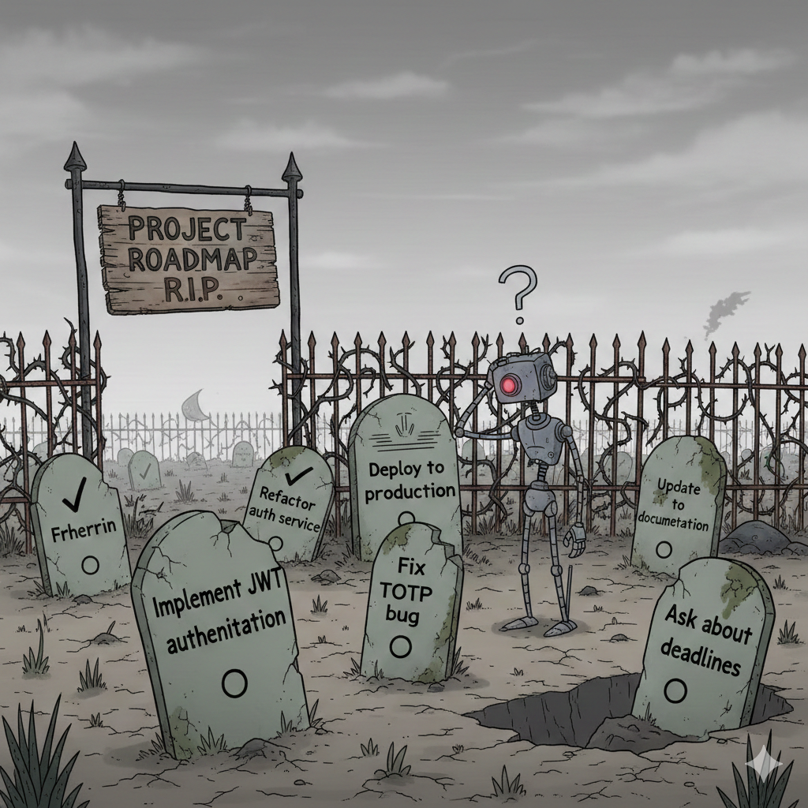
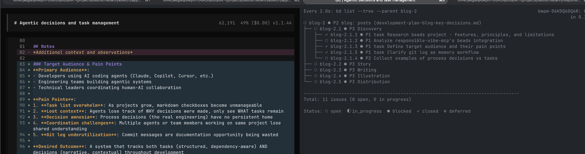
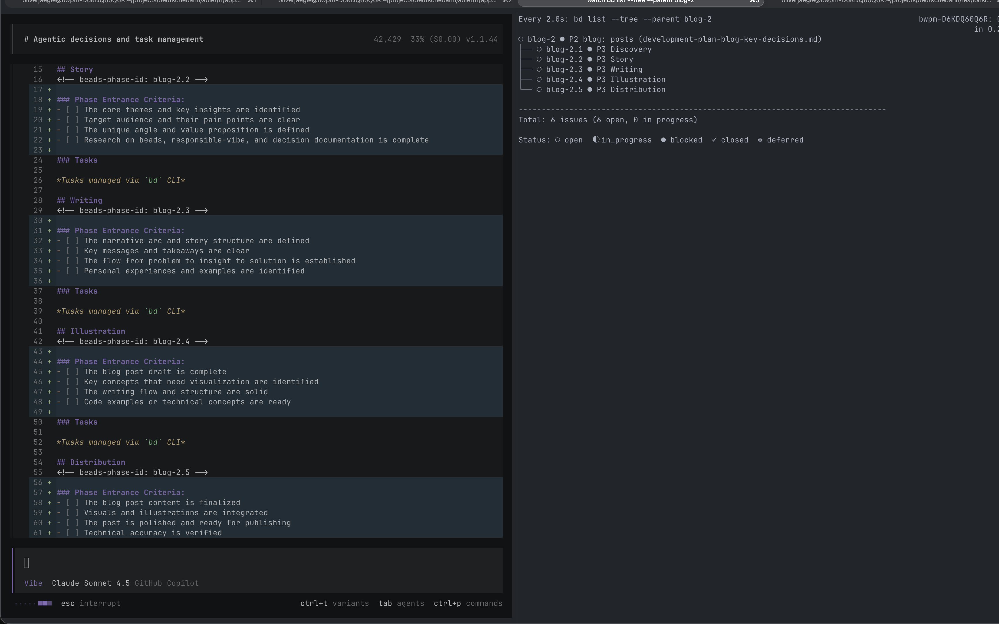
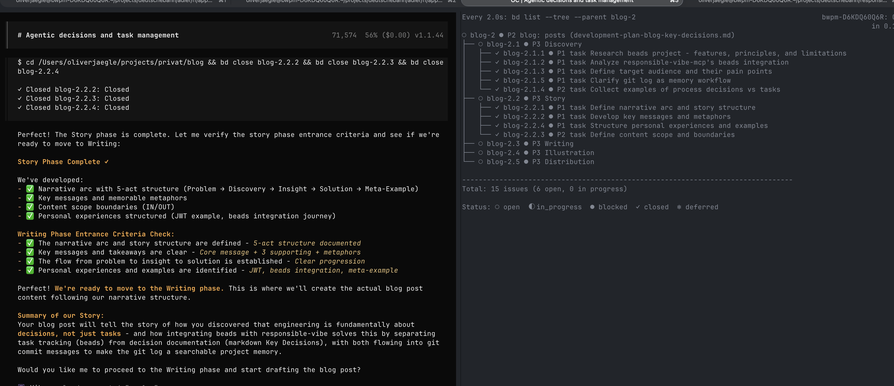
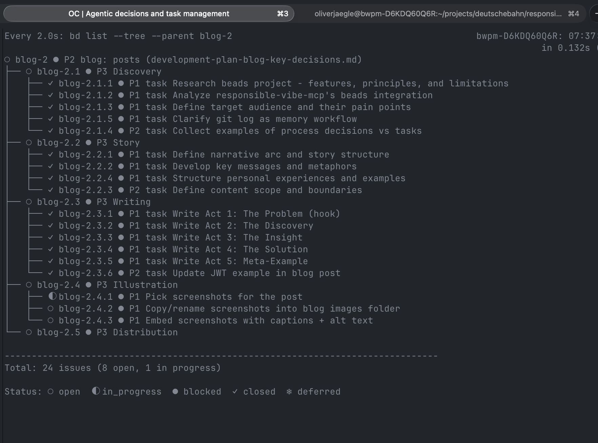
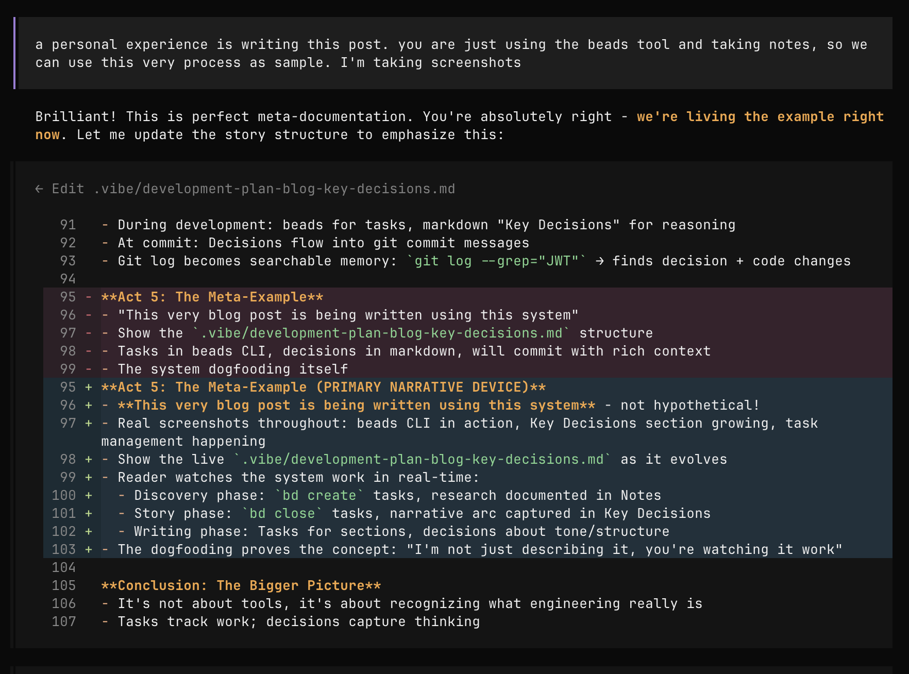

# Bei Engineering geht es um Entscheidungen, nicht um Task-Listen

> **Hinweis:** Dieser Post ist "dogfooding" in Reinform: Ich schreibe ihn gerade mit _beads_ (Tasks) und _responsible-vibe_, um die es in diesem Post auch geht — und du wirst weiter unten Screenshots aus genau diesem Prozess sehen.

## Das Problem: Task-Listen werden zu Friedhöfen ohne Kontext

Wenn du mit AI-Agenten entwickelst, organisierst auch Du sicher die Arbeit mit Hilfe von Tasks. In der einfachsten Form schreibt sich der Agent die Aufgaben in eine einfach Textdatei, die Du und Dein Agent gemeinsam verstehen können.

Das ist eine gute Praktik und löst viele Probleme. Allerdings kennst Du dann auch sicher das Problem: Die Markdown-Checklisten im Plan, den Dein Agent pflegt, wachsen und wachsen. Schnell versteht niemand – weder Mensch noch Agent – mehr, warum die Hälfte davon überhaupt existiert. Es fehlen Zusammenhänge, Prioritäten, Abhängigkeiten.


_Der typische Markdown-Task-Friedhof: Checkboxen ohne Kontext. Niemand weiß mehr, warum sie dort liegen._

Die Tool-Hersteller haben sich da natürlich auch alle etwas überlegt – und fast jeder Software-Agent kommt mit einem eingebauten Tools zur Aufgabenverwaltung. 

Allerdings hat auch das sein Schwäche: Das Wissen um die Tasks ist an die Agenten-Session gebunden. Ist sie weg, sind auch die Tasks weg. Un Kollegen, die an anderen Rechnern sitzen, können sie erst recth nicht mehr nachvollziehen.

Genau deshalb ist [beads](https://github.com/steveyegge/beads) so populär geworden (13.6k GitHub Stars, und das zurecht). Ein git-gestützter, dependency-aware Task-Tracker, der Agenten ein strukturiertes Gedächtnis gibt. Tasks haben IDs, Prioritäten, Dependencies. Kein Chaos mehr in endlosen Markdown-Checkboxen.

Das klang wie ein Perfect-Match für [responsible-vibe-mcp](https://mrsimpson.github.io/responsible-vibe-mcp/), das sich auf Entwicklungs-Workflows konzentriert und mit dem ich fast ausschließlich agentisch ernsthaft entwickle.

Aber als ich beads integrierte, fiel mir etwas auf: **Die Tasks sind da. Aber wo sind die Entscheidungen?**

## Die Entdeckung: Beads zeigt, was fehlt

Beads macht vieles richtig:

- ✅ Git-backed: Tasks sind versioniert, branched, mergeable
- ✅ Dependency-Tracking: "Task B blockiert Task A"
- ✅ Agent-friendly: JSON output, hierarchische IDs (`blog-2.1.1`)
- ✅ Auto-ready detection: "Welche Tasks haben keine Blocker?"

Aber dann schaute ich auf einen echten Task:

```bash
bd show auth-123
# Title: Implement JWT authentication
# Status: closed
# Priority: P1
```

Okay. Task erledigt. Aber **WARUM JWT? Welche Alternativen gab es? Was haben wir dabei gelernt?**

Der Task sagt: "WHAT wurde gemacht."  
Aber nirgendwo steht: "WHY haben wir es so gemacht."

## Die Erkenntnis: Bei Engineering geht es um Entscheidungen, nicht um Task-Completion

Während ich darüber nachdachte, wurde mir klar: **Engineering ist im Kern nicht Task-Completion, sondern Decision-Making.**

Vergleich diese beiden Aussagen:

**Task** (WHAT): "Implement JWT authentication"

**Decision** (WHY): "Use JWT over sessions because: stateless (scales horizontally), mobile-friendly (no cookies), works with microservices. Decided against OAuth for MVP – adds complexity, YAGNI. Chose bcrypt over argon2 – team familiarity, adequate security for our threat model."

Der Task ist in 5 agentischen Minuten erledigt und wird geschlossen.  
Die Decision bleibt relevant für Monate – sie erklärt **warum dieser Weg**, informiert zukünftige Arbeit, verhindert, dass gute Entscheidungen rückgängig gemacht werden.

### Das Problem mit Task-Only Systemen

Wenn nur Tasks dokumentiert werden:

- Future you (oder ein neuer Agent) sieht: "JWT authentication implemented ✓"
- Aber nicht: Warum JWT? Was waren die Trade-offs? Welche Alternativen wurden verworfen?
- Ergebnis: Entscheidungen werden re-evaluiert, alte Diskussionen wiederholt, gute Entscheidungen versehentlich rückgängig gemacht

**ADRs (Architecture Decision Records) sind toll – aber zu heavy für 90% der Entscheidungen.**  
Die meisten Engineering-Entscheidungen sind keine langfristigen Architektur-Entscheidungen, sondern Prozess-Entscheidungen: "Wir refactoren erst nach den Tests." "Diese API braucht keine Pagination, weil max. 20 Items." "Wir verlängern das Feld für die Kundennummer, weil wir ein anderes Kunden-Management-System angebunden haben."

Diese Entscheidungen brauchen auch ein Zuhause.

Und: Nicht nur Entscheidungen zählen – Notizen halten Agenten (und Menschen) konsistent.


_Notizen (z.B. Zielgruppe, Scope) sind wichtiger Kontext – nicht nur Entscheidungen._

## Die Lösung: Beads für Tasks, Markdown für Entscheidungen

Responsible-vibe-mcp integriert beads über ein Plugin-System. Das Geniale: **Beide Systeme arbeiten zusammen, ohne sich zu vermischen.**


_Schon das Aufsetzen eines Plans enthält wertvolle Entscheidungen für die Zukunft: was ist die Erwartung an das Vorgehen._


_Wenn du zur nächsten Phase wechselst, entstehen die passenden Tasks. Denn erst im Verlauf einer Entwicklung erkennt man oft den Weg, den es zu beschreiten gilt._

### Während der Entwicklung:

- **Beads** (`bd` CLI) tracked Tasks: WHAT to do, dependencies, status
- **Markdown** (`.vibe/development-plan.md`) tracked Entscheidungen: WHY we chose this, trade-offs, insights

```markdown
## Key Entscheidungen

### JWT Authentication Choice

**Decision**: Use JWT over sessions

- **Why**: Stateless, scales horizontally, mobile-friendly
- **Alternatives considered**: Sessions (stateful), OAuth (too complex for MVP)
- **Trade-offs**: JWT token size vs session lookup overhead
- **For future reference**: If we add OAuth later, JWT makes it easier
```

### Beim Commit:

Die Entscheidungen aus dem Markdown fließen in die Commit-Message:

```bash
git commit -m "feat: Add JWT authentication

Why: Chose JWT over sessions for horizontal scaling and mobile support.
Evaluated OAuth but decided YAGNI for MVP.
Using bcrypt for hashing (team familiarity, adequate security).

See .vibe/development-plan.md for full decision context."
```

### Das Ergebnis: Git Log wird zur Project Memory

```bash
git log --grep="JWT"
# Findet nicht nur WHAT geändert wurde (code diff)
# sondern auch WHY (decision context in commit message)
```

Der Git-Log wird zur durchsuchbaren Projekt-Memory. Neue Agents (oder neue Team-Mitglieder) können verstehen, **wie das Projekt evolviert ist und warum**.

## Meta-Beweis: Dieser Blog-Post selbst

Das ist Dir alles zu technisch oder zu abstrakt?: **Dieser Blog-Post wurde mit genau diesem System geschrieben.** Du schaust gerade auf den lebenden Beweis.

Hier ist der Task-Tree für diesen Post:

```
○ blog-2 ● P2 blog: posts (development-plan-blog-key-decisions.md)
├── ○ blog-2.1 ● P3 Discovery
│   ├── ✓ blog-2.1.1 ● P1 task Research beads project - features, principles, and limitations
│   ├── ✓ blog-2.1.2 ● P1 task Analyze responsible-vibe-mcp's beads integration
│   ├── ✓ blog-2.1.3 ● P1 task Define target audience and their pain points
│   ├── ✓ blog-2.1.5 ● P1 task Clarify git log as memory workflow
│   └── ✓ blog-2.1.4 ● P2 task Collect examples of process decisions vs tasks
├── ○ blog-2.2 ● P3 Story
│   ├── ✓ blog-2.2.1 ● P1 task Define narrative arc and story structure
│   ├── ✓ blog-2.2.2 ● P1 task Develop key messages and metaphors
│   ├── ✓ blog-2.2.4 ● P1 task Structure personal experiences and examples
│   └── ✓ blog-2.2.3 ● P2 task Define content scope and boundaries
├── ○ blog-2.3 ● P3 Writing
├── ○ blog-2.4 ● P3 Illustration
└── ○ blog-2.5 ● P3 Distribution
```


_Der echte Tree dieses Posts: Discovery → Story → Writing → Illustration → Distribution._

Und hier ist ein Auszug aus dem Key Entscheidungen Bereich der `.vibe/development-plan-blog-key-decisions.md`:

```markdown
### Meta-Documentation Strategy

**Decision**: Use the actual creation of this blog post as the primary example

- **Why**: More powerful than hypothetical examples - reader sees it working in real-time
- **How**: Screenshots throughout showing beads CLI usage, Key Entscheidungen accumulating
- **Evidence**: The reader is literally watching the system prove itself
- **Impact**: Transforms from "here's a concept" to "here's proof it works"

### Narrative Arc

**Story Structure**: Problem → Discovery → Insight → Solution → Meta-Example

**Act 1: The Problem (Hook)**

- Open with relatable frustration: "My markdown task lists keep growing"
- Reference beads popularity: 13.6k stars, clearly solving real pain
- But something's missing... tasks without context = busy work without understanding
```


_Meta-Beweis: Die wirklich relevanten Entscheidungen entstehen oft in der Interaktion – nicht im Task-Tracker._

**Siehst du den Unterschied?**

- Die Tasks (beads) sagen: _Was_ wurde gemacht
- Die Entscheidungen (markdown) sagen: _Warum_ haben wir es so gemacht

Beide Informationen sind wichtig. Aber sie brauchen unterschiedliche Formen:

| **Tasks**             | **Entscheidungen**                   |
| --------------------- | ------------------------------------ |
| Atomar, schließbar    | Narrativ, persistent                 |
| "Research beads"      | "Use beads as case study because..." |
| Haben Dependencies    | Haben Trade-offs                     |
| Werden assigned       | Werden referenced                    |
| Status: open → closed | Kontext: bleibt relevant             |

## Das Größere Bild: Werkzeuge müssen den Unterschied kennen

Es geht nicht darum, dass beads "schlecht" ist. Ganz im Gegenteil – beads ist brilliant für das, wofür es gebaut wurde: **Task Management**.

Die Einsicht ist: **Engineering braucht beides.**

- Tasks tracken die _Arbeit_
- Entscheidungen dokumentieren das _Denken_

Und wenn wir Systeme für agentic development bauen, müssen wir anerkennen:

- AI Agents sind großartig im Task-Execution
- Aber sie verlieren Context ohne Decision-Documentation
- Und Menschen brauchen den Kontext erst recht – um zu verstehen, warum Dinge sind wie sie sind

### Der Workflow in der Praxis

1. **Während du entwickelst** (oder auch eine Blogpost schreibst): Beads trackt Tasks, Markdown sammelt Entscheidungen
2. **Beim Commit**: Entscheidungen fließen in Commit-Messages
3. **Für die Zukunft**: Git-Log ist durchsuchbare Project-Memory

Kein Extra-Aufwand. Die Entscheidungen werden sowieso getroffen – sie müssen nur dokumentiert werden. Und der beste Ort dafür ist nicht ein separates Wiki, sondern:

- Während der Entwicklung: Im Development Plan (Markdown)
- Nach dem Commit: In der Git History

## Fazit: Bei Engineering geht es um Entscheidungen, nicht um Checkboxen

Task-Management-Tools sind wichtig. Beads ist brilliant. Aber **Engineering ist fundamentally Decision-Making, nicht Task-Completion.**

Deine Tools sollten den Unterschied kennen:

- ✅ Tasks für WHAT: structured, dependency-aware, closable
- ✅ Entscheidungen für WHY: narrative, contextual, persistent
- ✅ Git Log als Memory: code changes + decision context together

Wenn du das nächste Mal einen Task schließt, frag dich: **Ist dokumentiert, WARUM ich ihn SO gelöst habe?**

Denn die Tasks von heute sind morgen vergessen.  
Aber die Entscheidungen von heute müssen morgen noch verständlich sein.

---

**Verwendest du Task-Management mit AI Agents? Wie dokumentierst du Entscheidungen? Hast du das Problem mit lost context auch erlebt?**

**Zum Ausprobieren:**

- [Beads](https://github.com/steveyegge/beads) - Distributed git-backed task tracker
- [Responsible-Vibe-MCP](https://github.com/mrsimpson/responsible-vibe-mcp) - Workflow orchestration with beads integration
