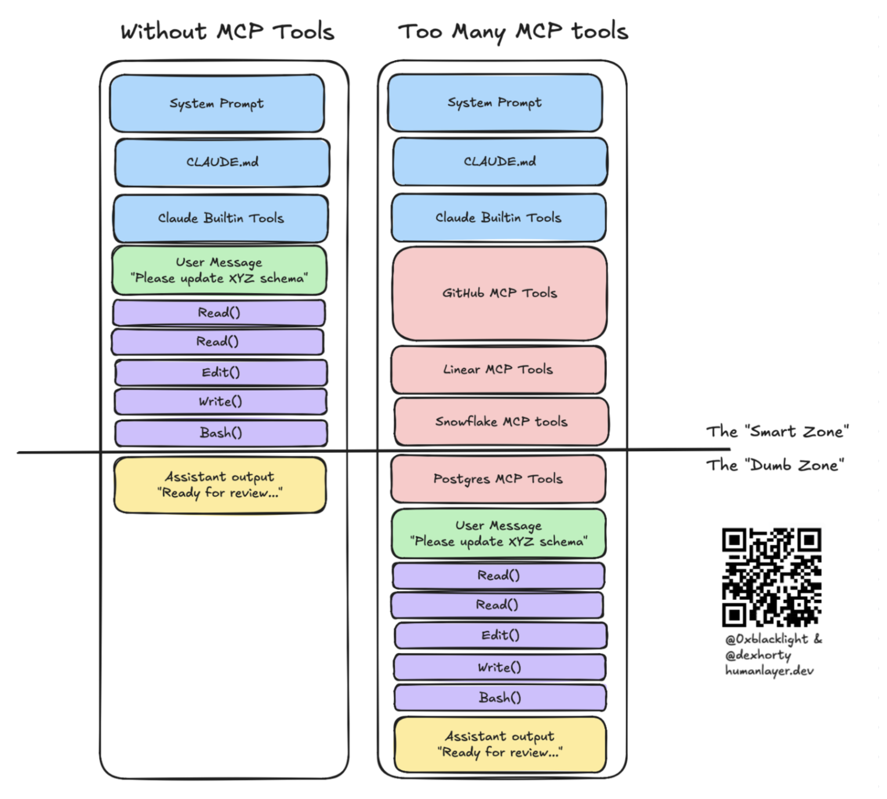

# Harness Engineering — warum eine Informationshierarchie den Unterschied macht

> tl;dr: "Harness Engineering beschreibt, _was_ man an Coding Agents konfigurieren kann. Aber das reicht nicht. Gutes Alignment entsteht erst, wenn wir Agenten so briefen, wie wir Menschen briefen würden: Process → Conventions → Documentation."

## Harness Engineering ist angekommen

Coding Agents sind heute mehr als ein Modell mit Chat-Interface. Sie bringen eine reichhaltige Konfigurationsoberfläche mit — den **Harness**.

Kyle von HumanLayer hat es auf den Punkt gebracht:

> `coding agent = AI model(s) + harness`

Der Harness umfasst alles, was das Modell umgibt: System-Prompts, CLAUDE.md/AGENTS.md, Skills, MCP-Server, Sub-Agents, Hooks, Back-Pressure-Mechanismen. [Harness Engineering](https://www.humanlayer.dev/blog/skill-issue-harness-engineering-for-coding-agents) — ein Begriff, den [Viv Trivedy](https://blog.langchain.com/the-anatomy-of-an-agent-harness/) geprägt hat — beschreibt die Praxis, diese Hebel systematisch zu nutzen.

Und die Hebel sind real. Wir können heute:

- dem Agenten über **Agentfiles** beibringen, wie unser Projekt funktioniert
- mit **Skills** modulare Fähigkeiten bereitstellen
- über **MCP-Server** neue Werkzeuge anschließen
- mit **Sub-Agents** Aufgaben isoliert delegieren
- durch **Hooks** deterministischen Kontrollfluss einbauen
- via **Back-Pressure** den Agenten seine eigene Arbeit verifizieren lassen

*Bild: [Viv Trivedy](https://blog.langchain.com/the-anatomy-of-an-agent-harness/) via [HumanLayer](https://www.humanlayer.dev/blog/skill-issue-harness-engineering-for-coding-agents)*

Die Konfigurationsoberfläche ist da. Die Frage ist nur: Wie nutzt man sie richtig?

## Mehr ist nicht besser

Die Intuition liegt nahe: Mehr Konfiguration müsste besseres Verhalten ergeben. Mehr Instructions, mehr Skills, mehr MCP-Server — mehr Kontext, mehr Wissen, bessere Ergebnisse.

Nur stimmt das nicht.

*Bild: [HumanLayer](https://www.humanlayer.dev/blog/skill-issue-harness-engineering-for-coding-agents)*

Eine [ETH-Zürich-Studie](https://arxiv.org/abs/2602.11988) hat 138 Agentfiles untersucht und festgestellt: LLM-generierte Agentfiles _schaden_ der Performance. Aufgeblähte Instruktionen kosten 20% mehr Tokens — ohne Verbesserung. Die menschlich geschriebenen Anleitungen halfen nur marginal. Das Problem sind nicht schlechte Instruktionen, sondern **zu viele** davon.

Je mehr Kontext ein Agent bekommt, desto weniger kohärent wird sein Verhalten. Das zeigt sich als Kontextdegradation — was Dex Horthy die ["Dumb Zone"](https://www.youtube.com/watch?v=rmvDxxNubIg) nennt —, als widersprüchliche Instruktionen, oder einfach als Rauschen, das relevante Information verdrängt.

Harness Engineering beschäftigt sich damit, _wie_ wir diese Umgebung konfigurieren können. Aber das eigentliche Ziel des kohärenten Kontexts wird nur dann erreicht, wenn es uns gelingt, strukturiert zu beeinflussen, _wann_ welche Information einfließt.

## Mental Alignment — das eigentliche Ziel

Denn eigentlich wissen wir schon länger, worauf es ankommt: **Mental Alignment** — das **gemeinsame** Verständnis zwischen Mensch und Agent darüber, _was_ getan werden soll und _wie_.

Wir nehmen die Ausgabe eines Agenten als "gut" wahr, wenn sie unsere Erwartungen trifft. Nicht wenn sie objektiv korrekt ist (das auch), sondern wenn sie dem entspricht, was wir _im Kopf hatten_. Das ist kein rein technisches Problem — es ist ein Problem der **geteilten mentalen Modelle**.

Aber das ist gar kein neues Problem: Wir haben gelernt, wie wir diese geteilte Verständigung mit Menschen hinbekommen. Jede Organisation macht es jeden Tag — beim Onboarding, bei Code Reviews, bei der Dokumentation.

Die Frage ist also: **Können wir ein mentales Modell verwenden, das auch bei Menschen funktioniert?**

## Eine menschliche Informationshierarchie

Stell dir vor, ein neuer Entwickler kommt in dein Team. Was passiert?

**Zuerst** lernt er den **Prozess**: Wie arbeiten wir hier? Wann müssen wir welche Dinge klären? Wie sieht ein PR-Review aus? Wann deployen wir? Das sind universelle Regeln — sie gelten meist sogar projektübergreifend, für alle, bei jeder Aufgabe.

**Dann** lernt er die **Konventionen**: Welche Architektur nutzen wir? React oder Vue? Wie strukturieren wir Tests? Welche Code-Styles gelten? Das ist projektspezifisches Wissen — er braucht es, sobald er an einer bestimmten Stelle arbeitet.

**Und Dokumentation?** Die zieht er heran, wenn er sie braucht. API-Referenzen, Library-Docs, Architektur-Diagramme. Kein Mensch liest die komplette Doku am ersten Tag. Er schlägt nach, was er gerade braucht.

**Process → Conventions → Documentation.**

Das ist keine neue Erfindung. Es ist, wie Menschen Wissen hierarchisch organisieren. Und genau das macht es so wertvoll für Agent-Konfiguration.

### Gerichtete Komposition

Der entscheidende Punkt: Diese Schichten komponieren **gerichtet**.

Process _nutzt_ Conventions: "Benutze den Design-Skill für diese Aufgabe."
Conventions _verweisen_ auf Documentation: "Die API-Referenz findest du in der Doku."

Aber nie umgekehrt. Die Dokumentation verändert nicht den Prozess. Die Konventionen stellen nicht die Arbeitsweise in Frage.

Das bedeutet: Information fließt in eine Richtung — von allgemein zu spezifisch, von immer-präsent zu on-demand.

### Progressive Disclosure — auf allen Ebenen

Was sich daraus ergibt, ist **Progressive Disclosure** — aber nicht als Technik, sondern als natürliche Konsequenz der Hierarchie.

- **Process** ist immer im Kontext. Das sind wenige, universelle Regeln — wie eine AGENTS.md unter 20 Zeilen.
- **Conventions** werden bei Bedarf geladen. Skills sind das perfekte Beispiel: Der Agent kennt die Namen und Beschreibungen, lädt die volle Anleitung aber erst, wenn er sie braucht. Wie ich in [meinem letzten Post zu Agent Skills](https://www.linkedin.com/pulse/agent-skills-f%25C3%25A4higkeiten-handlichem-paket-oliver-j%25C3%25A4gle-785zc) beschrieben habe.
- **Documentation** wird on-demand herangezogen. Sub-Agents können als Context-Firewall dienen — sie recherchieren in einem isolierten Kontext und liefern nur das komprimierte Ergebnis zurück.

### Warum "menschlich" hier kein Buzzword ist

Dieses Modell funktioniert nicht, _obwohl_ es menschlich ist — sondern _weil_ es menschlich ist.

Wenn wir dem Agenten Information in einer Hierarchie geben, die unserem eigenen Denken entspricht, können wir seine Ausgaben besser einschätzen. Wir wissen, welchen Prozess er kennt. Wir wissen, welche Konventionen er geladen hat. Wir können seine Entscheidungen nachvollziehen — weil sie dem Modell folgen, das wir selbst im Kopf haben.

**Das ist Mental Alignment:** Nicht der Agent wird menschlicher — wir machen unsere Erwartungen explizit (auch gegenüber uns selbst!) und für den Agenten navigierbar.

## Ausblick: Und wenn man das formalisiert?

Process → Conventions → Documentation — das klingt einfach. Aber die praktische Umsetzung wirft Fragen auf:

- Wie entscheide ich, was Process ist und was Convention?
- Wie stelle ich sicher, dass ein ganzes Team dieselbe Hierarchie nutzt?
- Wie mache ich die Konfiguration reproduzierbar — über verschiedene Agents und Harnesses hinweg?

Wenn das Modell stimmt, sollte man es formalisieren können. Genau darüber schreibe ich im nächsten Post.

---

# Harness Engineering — Why an Information Hierarchy Makes All the Difference

> tl;dr: "Harness engineering describes _what_ you can configure on coding agents. But that's not enough. True alignment emerges when we brief agents the way we'd brief humans: Process → Conventions → Documentation."

## Harness Engineering Has Arrived

Coding agents today are more than a model with a chat interface. They come with a rich configuration surface — the **harness**.

Kyle from HumanLayer put it succinctly:

> `coding agent = AI model(s) + harness`

The harness encompasses everything surrounding the model: system prompts, CLAUDE.md/AGENTS.md, skills, MCP servers, sub-agents, hooks, back-pressure mechanisms. [Harness engineering](https://www.humanlayer.dev/blog/skill-issue-harness-engineering-for-coding-agents) — a term coined by [Viv Trivedy](https://blog.langchain.com/the-anatomy-of-an-agent-harness/) — describes the practice of leveraging these levers systematically.

And the levers are real. Today we can:

- teach the agent about our project via **agentfiles**
- provide modular capabilities through **skills**
- connect new tools via **MCP servers**
- delegate tasks in isolation with **sub-agents**
- introduce deterministic control flow through **hooks**
- let the agent verify its own work via **back-pressure**

*Image: [Viv Trivedy](https://blog.langchain.com/the-anatomy-of-an-agent-harness/) via [HumanLayer](https://www.humanlayer.dev/blog/skill-issue-harness-engineering-for-coding-agents)*

The configuration surface is there. The only question is: How do you use it properly?

## More Is Not Better

The intuition seems obvious: more configuration should yield better behavior. More instructions, more skills, more MCP servers — more context, more knowledge, better results.

Except it doesn't work that way.

*Image: [HumanLayer](https://www.humanlayer.dev/blog/skill-issue-harness-engineering-for-coding-agents)*

An [ETH Zurich study](https://arxiv.org/abs/2602.11988) examined 138 agentfiles and found: LLM-generated agentfiles actually _hurt_ performance. Bloated instructions cost 20% more tokens — with no improvement. The human-written ones helped only marginally. The problem isn't bad instructions — it's **too many** of them.

The more context an agent receives, the less coherent its behavior becomes. This manifests as context degradation — what Dex Horthy calls the ["dumb zone"](https://www.youtube.com/watch?v=rmvDxxNubIg) —, as contradictory instructions, or simply as noise that displaces relevant information.

Harness engineering addresses _how_ we can configure this environment. But the actual goal of coherent context is only achieved when we manage to structurally influence _when_ which information flows in.

## Mental Alignment — The Real Goal

Because we've actually known for a while what really matters: **mental alignment** — the **shared** understanding between human and agent about _what_ should be done and _how_.

We perceive an agent's output as "good" when it meets our expectations. Not when it's objectively correct (that too), but when it matches what we _had in mind_. This isn't a purely technical problem — it's a problem of **shared mental models**.

But this isn't a new problem at all: We've learned how to achieve this shared understanding with humans. Every organization does it every day — during onboarding, in code reviews, through documentation.

So the question is: **Can we use a mental model that also works for humans?**

## A Human Information Hierarchy

Imagine a new developer joins your team. What happens?

**First**, they learn the **process**: How do we work here? When do we need to clarify what? What does a PR review look like? When do we deploy? These are universal rules — they often apply across projects, for everyone, on every task.

**Then** they learn the **conventions**: What architecture do we use? React or Vue? How do we structure tests? What code styles apply? This is project-specific knowledge — they need it once they're working on a particular area.

**And documentation?** They consult it when they need it. API references, library docs, architecture diagrams. No one reads the complete documentation on day one. They look up what they need right now.

**Process → Conventions → Documentation.**

This isn't a new invention. It's how humans organize knowledge hierarchically. And that's exactly what makes it so valuable for agent configuration.

### Directional Composition

The crucial point: these layers compose **directionally**.

Process _invokes_ conventions: "Use the design skill for this task."
Conventions _point to_ documentation: "You'll find the API reference in the docs."

But never the other way around. Documentation doesn't change the process. Conventions don't question the way of working.

This means: information flows in one direction — from general to specific, from always-present to on-demand.

### Progressive Disclosure — At Every Level

What follows from this is **progressive disclosure** — not as a technique, but as a natural consequence of the hierarchy.

- **Process** is always in context. These are few, universal rules — like an AGENTS.md under 20 lines.
- **Conventions** are loaded on demand. Skills are the perfect example: the agent knows the names and descriptions but only loads the full guide when needed. As I described in [my previous post about skills](https://www.linkedin.com/pulse/agent-skills-f%25C3%25A4higkeiten-handlichem-paket-oliver-j%25C3%25A4gle-785zc).
- **Documentation** is consulted on demand. Sub-agents can serve as a context firewall — they research in an isolated context and return only the compressed result.

### Why "Human" Isn't a Buzzword Here

This model doesn't work _despite_ being human — it works _because_ it's human.

When we give an agent information in a hierarchy that matches our own thinking, we can better evaluate its output. We know what process it's aware of. We know which conventions it has loaded. We can follow its decisions — because they follow the model we ourselves have in mind.

**That's mental alignment:** The agent doesn't become more human — we make our expectations explicit (to ourselves, too!) and navigable for the agent.

## Outlook: What If You Formalize This?

Process → Conventions → Documentation — it sounds simple. But the practical implementation raises questions:

- How do I decide what's process and what's convention?
- How do I ensure an entire team uses the same hierarchy?
- How do I make the configuration reproducible — across different agents and harnesses?

If this model is sound, it should be possible to formalize it. That's exactly what I'll write about in the next post.
