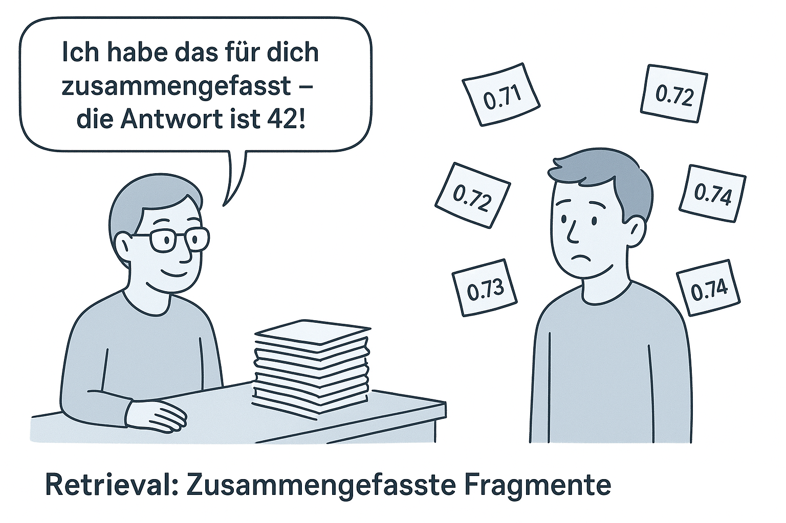
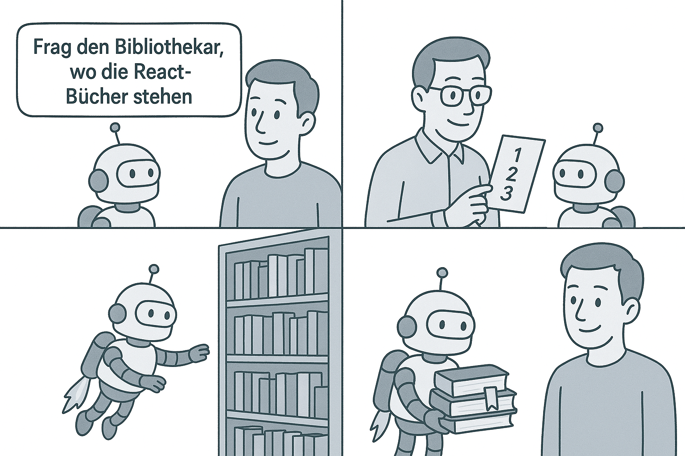
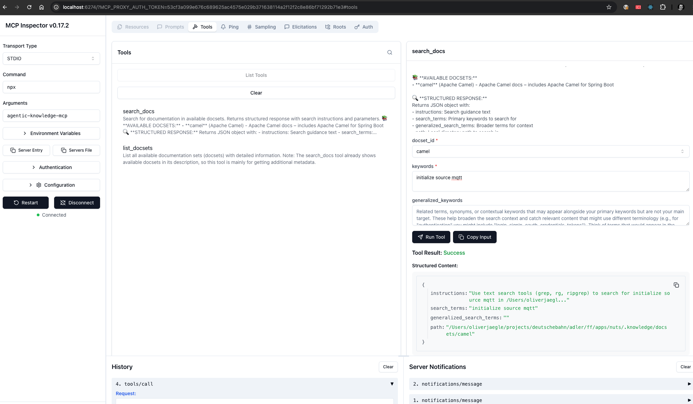
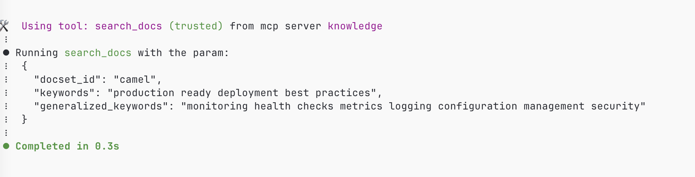

# Langzeitgedächtnis durch Navigation, nicht Retrieval

> tl;dr: "RAG sollte das Knowledge-Cut-Off-Problem lösen, aber für Dokumentation funktioniert es nicht gut. Agenten haben bereits perfekte Tools, um passende Informationen zu finden – sie brauchen nur Anleitung, wo sie suchen sollen."

In meinen letzten Posts habe ich über Context Engineering und responsible-vibe geschrieben - wie man Agenten mit den richtigen Informationen zur richtigen Zeit versorgt. Dabei entstand ein Framework mit drei Ebenen:

1. **Conversation Memory**: Systematisches Denken und organisierte Problemanalyse
2. **Process Memory**: Phasenspezifische Entwicklungspläne und Fortschrittsverfolgung  
3. **Long-term Memory**: Requirements, Dokumentation, Rules

[responsible-vibe-mcp](https://github.com/mrsimpson/responsible-vibe-mcp) adressiert die ersten beiden Ebenen ziemlich gut. Aber Layer 3 blieb ungelöst. Die internen Projekt-Docs sind im Griff - aber was ist all den Dependencies und externen Frameworks, die man täglich braucht? Das aktuelle Angular? Oder die neueste Version von Apache Flink? Oder unsere Best Practices zu Spring in der Firma?

## Das Knowledge-Cut-Off-Problem

RAG - Retrieval-Augmented Generation - sollte das Knowledge-Cut-Off-Problem lösen. Die Idee: Gib dem LLM Zugriff auf aktuelle Dokumentation, die nicht im Training war. 

Viele Tools versuchen das zu lösen: IDEs mit integriertem RAG (Cursor war da Vorreiter), [gitmcp.io](https://gitmcp.io) oder [mcp-ragdocs](https://github.com/rahulretnan/mcp-ragdocs). Alles sinnvolle Ansätze.

Also tat ich, was ich immer tue: **Ich baute es, um es zu verstehen.**

Oft führt das Bauen dazu, dass man am Ende doch nutzt, was andere gebaut haben - und das ist vollkommen okay! Der Punkt ist das Verstehen. Dieses Mal aber offenbarte der Bauprozess etwas Wichtiges.

### Die Dokumentations-Herausforderung

Ich fing an: Embeddings, Chunking, Vector Search. Und schnell wurde klar - **Dokumentations-Chunks sehen sich alle ähnlich.**

- API-Referenzen vermischen sich
- Tutorial-Abschnitte haben ähnliche Struktur  
- Code-Beispiele sehen alle gleich aus
- Similarity Scores: 0.71, 0.72, 0.73, 0.74, 0.75

**Welcher ist tatsächlich relevant?** Die Rankings sagen es nicht. Die top k=10 Ergebnisse lagen alle zwischen 0.71 und 0.75 - praktisch nicht unterscheidbar.

Das Problem sind die **kaskadierten Fehler**: Chunking → Embedding → BM25 → Hybrid Fusion → Reranking. Jede Stufe verstärkt die Fehler der vorherigen. Fragment-Retrieval zerstört Kontext und Zusammenhänge.



**RAG funktioniert hervorragend für strukturierte Daten** - Warehouse-Inventar, Verkaufsdaten, Kundenprofile. Aber für textlastige Dokumentation? Geht das nicht besser?

Bei meiner Recherche fand ich einen [Blogpost von Nicolas Bustamante](https://www.nicolasbustamante.com/p/the-rag-obituary-killed-by-agents). Der hat viel mehr Erfahrung mit RAG als ich und brachte alles auf den Punkt – vor allem hatten wir eine gemeinsame Beobachtung

## Agenten haben bereits die perfekten Tools

Während ich responsible-vibe baute, beobachtete ich etwas Faszinierendes: **Agenten navigieren Project-Docs brillant mit ihren eingebauten Tools.**

- grep und ripgrep  
- Datei-Lesezugriff
- Direkte Text-Suche

Diese Tools wurden über **50 Jahre hinweg verfeinert** - speziell für Text-Navigation. grep stammt aus 1973. Es ist so... primitiv. Und genau das ist genial daran.

### Das Muster wurde klar

Agenten haben keine Probleme mit Text - sie sind exzellent darin. Sie haben **zweckgebaute Tools**, die Menschen über Jahrzehnte perfektioniert haben:

- Keine Embeddings nötig - exakte Matches funktionieren besser für Docs
- Keine Similarity Scores - Präzision statt Approximation  
- Keine Infrastructure - einfach direkte Suche

**Und die Context Revolution macht das praktisch:**

- 2022: 8K tokens (passt nicht viel rein)
- 2025: 200K tokens (ganze Codebases)  
- Bald: 2M+ tokens (alle Dependencies)

Nicolas brachte es auf den Punkt:

> "Claude Code doesn't retrieve. It investigates."

Und er hat recht. Claude Code benutzt kein RAG. Es navigiert. Und es funktioniert besser.

### Die Epiphanie

Agenten haben bereits alles, was sie für Text brauchen:

- **Tools**: grep, file reading, search
- **Context**: massive Fenster (200K+ tokens)
- **Fähigkeit**: werden immer besser in Navigation
- **Stärke**: können selbst Suchbegriffe wählen - und verwandte Begriffe aus dem Kontext ableiten

Was ihnen fehlt, ist **Anleitung**:
- In welchen Repos schauen?
- Wo mit der Suche anfangen?
- Wie sind die Docs strukturiert?

**Die Erkenntnis**: Langzeitgedächtnis für Dokumentation geht nicht um Retrieval oder Storage - es geht um **intelligente Navigation**.

## Die Lösung: Einfache Navigation

Was wäre, wenn wir statt Fragmente zu holen, **Navigations-Anweisungen** geben?

Statt: "Hier sind 50 Chunks, die 'useState' erwähnen"

Besser: "Such in `./docs/react-18.2/hooks/`. Die MCP Tool-Beschreibung leitet dich an: Nutze spezifische Begriffe wie 'useState' und verwandte Begriffe wie 'state management' oder 'hooks lifecycle'. Das LLM kann dann seine Stärke ausspielen - genau die Begriffe zu finden, die zum Kontext passen."

Alle relevante Dokumentation muss einfach nur so vorliegen, als wäre sie Teil unserer eigenen Code-Basis!

Das ist die Idee hinter [agentic-knowledge-mcp](https://github.com/mrsimpson/agentic-knowledge-mcp) - einem unglaublich einfachen MCP Server, der externe Dokumentation in den lokalen Kontext des Agenten bringt.

### Wie es funktioniert



**Schritt 1: Experte definiert relevante Datenquellen**

Ein Experte (z.B. du!) definiert die Docsets via YAML-Config und CLI. Das ist der erste Schritt im Comic - jemand muss dem Agenten sagen, wo die Bibliothek ist.

Mittels CLI wird eine einfache YAML-Config im Repo hinterlegt. Das macht die Information über die Wissensquellen austauschbar zwischen Teammitgliedern.

```yaml
version: "1.0"
docsets:
  - id: react-docs
    name: React Documentation
    sources:
      - type: git_repo
        url: "https://github.com/facebook/react.git"
        paths: ["docs/"]
```

**Schritt 2: MCP Server gibt Navigations-Anweisungen**

Der Server erstellt Symlinks für lokale Ordner oder klont Git-Repos. Dann gibt er **Navigations-Anweisungen** statt Dokument-Fragmente.



Nach was gesucht werden soll, wird über die MCP Tool-Parameter-Beschreibung instruiert: Sie leitet das LLM an, spezifische Begriffe und verwandte Begriffe zu nutzen. Das LLM kann dann seine Stärke ausspielen - genau die Begriffe zu finden, die zum Kontext passen.

**Schritt 3: Agent navigiert intelligent**



Der Agent nutzt seine eingebauten Tools (grep, file reading) und folgt den Navigations-Anweisungen. Genau wie der düsengetriebene Agent im Comic: Bücherregal suchen → Buch holen → Seite aufschlagen → Cross-Reference folgen.

**Die Vorteile:**

- Sub-10ms Antwortzeiten (vs. 300-2000ms bei RAG)
- Zero Infrastructure (keine Vector DBs, Embeddings, Reranker)
- Nutzt die vorhandenen Agent-Tools (grep, ripgrep, Dateizugriff)
- Keine AI-Abhängigkeit - pure Logik-basierte Anleitung

### Die Drei-Ebenen-Vervollständigung

Damit ist das Context Engineering Framework komplett:

- **Layer 1 (Conversation Memory)**: responsible-vibe ✓
- **Layer 2 (Process Memory)**: responsible-vibe ✓
- **Layer 3 (Long-term Memory)**: agentic-knowledge ✓

## Das richtige Werkzeug für den Job

Was ich durch diese Reise gelernt habe:

**RAG löst strukturierten Datenzugriff hervorragend.** Warehouse-Daten, Customer Profiles, Sales Records - dafür ist RAG perfekt.

**Aber für das Knowledge-Cut-Off-Problem bei Dokumentation** haben Agenten bereits bessere Tools. Sie brauchen keine Fragment-Retrieval - sie brauchen Anleitung zur Navigation.

Es geht darum, **das richtige Werkzeug für den richtigen Job zu nutzen**:

- RAG für strukturierte Daten  
- Navigation für Dokumentation
- Und für das Knowledge-Cut-Off: Zugriff auf aktuelle Docs mit den Tools, die Agenten bereits beherrschen

## Vorhersehbare Inferenz statt Magie

Was agentic-knowledge mit responsible-vibe verbindet, ist mehr als nur die Vervollständigung der drei Ebenen. Es ist ein gemeinsames Prinzip: **nachvollziehbare, vorhersehbare Inferenz**.

RAG ist eine Black Box. Warum wurde dieser Chunk gewählt? Warum 0.72 statt 0.71? Man kann es nicht nachvollziehen.

Agentisches Handeln dagegen verstehen wir Humanoide gut:
- "Ich habe in diesem Pfad nach diesen Begriffen gesucht"
- "Ich habe diese Datei gelesen, weil sie im Suchergebnis war"
- "Ich folge diesem Cross-Reference zu Note 12"

Das ist es, worauf es beim Software-Entwickeln letztendlich ankommt: **Wir wollen keine Magie, sondern nachvollziehbare Exzellenz.**

responsible-vibe gibt Prozess-Struktur, damit wir verstehen, wo der Agent gerade ist und was er tut. agentic-knowledge gibt Navigations-Struktur, damit wir verstehen, wo der Agent sucht und warum.

Beides zusammen: Vorhersehbar. Nachvollziehbar. Vertrauenswürdig.

---

[agentic-knowledge-mcp](https://github.com/mrsimpson/agentic-knowledge-mcp) ist Open Source. Es ist noch nicht super dokumentiert, aber funktioniert bei mir schon ganz gut. Ich freue mich über Probanten und Feedback ;)

Welche Erfahrungen hast du mit dem Knowledge-Cut-Off-Problem gemacht? Ich freue mich auf den Austausch in den Kommentaren!
