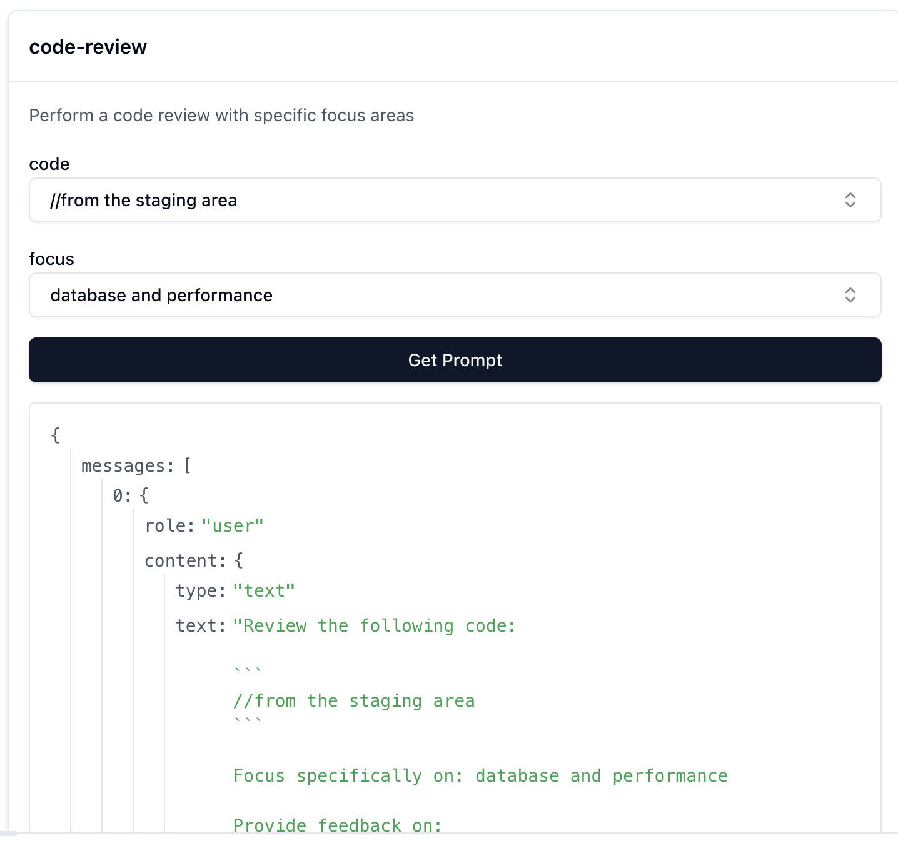

# Prompts als Code: Von der Skepsis zum Werkzeug

Ich habe Prompts lange belächelt – nicht weil ich nicht verstanden hätte, was sie sollen, sondern weil ich das klassische Dilemma erlebt habe: Prompts sind entweder zu simpel und bringen kaum Nutzen, oder sie sind so detailliert, dass ich sie für jeden Kontext anpassen muss und kaum wiederverwenden kann.

Damit schienen mir Prompts wenig sinnvoll, zumindest bis ich mich selbst dabei erwischte, wie ich trotz [responsible-vibe-mcp](https://github.com/mrsimpson/responsible-vibe-mcp) – meinem MCP-Server, der meinen Entwicklungsprozess strukturiert – immer wieder die gleichen Anweisungen tippte.

## Das Problem: Wiederholung im Entwicklungsprozess

Drei Beispiele, die mir immer wieder begegneten (simplifiziert): Code-Reviews mit den immer gleichen Kriterien wie Performance, Lesbarkeit und Error-Handling. Test-Erstellung nach BDD für Edge Cases und Fehlerbehandlung. Oder das Aufräumen der Dokumentation, bei dem ich veraltete TODOs bereinige und Code-Kommentare aktualisiere.

Kurz, prägnant – und immer wieder die gleiche Struktur. Nur der Kontext änderte sich: mal war es ein anderes Modul, mal eine andere Komponente, mal ein anderer Aspekt der Qualitätsprüfung.

## Die Erkenntnis: Software-ENGINEERING

Als Software-ENGINEER (und nicht nur Software-Entwickler) gilt für mich ein einfaches Prinzip: Wenn ich den gleichen Handgriff dreimal mache, baue ich eine Schablone. Das ist das Handwerker-Prinzip – von Ad-hoc zu systematisch, von Wiederholen zu Werkzeug, und letztlich von Wiederholung über Werkzeug zur Qualität.

Wenn ich etwas wiederhole, ist das ein Signal: Hier lohnt es sich, ein Werkzeug zu bauen, nicht nur um mir selbst Zeit zu sparen, sondern auch um die Qualität iterativ zu verbessern – so wie ich es mit Code mache.

## Von simpel zu parametrisiert – wie bei Code

Nehmen wir das Code-Review-Beispiel: Wie würde ich das als Prompt bauen? Die erste Version ist zu simpel – "Reviewe den Code" funktioniert zwar, aber ohne Struktur oder klare Kriterien ist sie wenig hilfreich. Die zweite Version wird zu detailliert: "Reviewe den folgenden TypeScript-Code auf Performance-Probleme, insbesondere bei Datenbankabfragen, und prüfe, ob die Error-Handling-Strategie mit unserem Team-Standard übereinstimmt..." – sehr spezifisch, aber ich muss sie für jedes Modul, jede Sprache und jeden Fokus neu schreiben.

Die dritte Version macht es wie bei Code: Genau wie ich aus Copy-Paste-Duplikaten eine Funktion mit Parametern extrahiere, kann ich das auch mit Prompts machen:

```markdown
---
name: code-review
description: Perform a code review with specific focus areas
arguments:
  - name: code
    description: The code to review
    required: true
  - name: focus
    description: Specific aspects to focus on
    required: false
---

Review the following code:

\`\`\`
{{code}}
\`\`\`

{{#if focus}}
Focus specifically on: {{focus}}
{{/if}}

Provide feedback on:
1. Code quality and maintainability
2. Potential bugs or issues
3. Performance considerations
4. Best practices
```

Die Grundstruktur bleibt stabil, während der variable Teil (`{{code}}`, `{{focus}}`) parametrisiert wird.

## Der Lernmoment: Das geht auch mit MCP!

Während einer explorativen Entwicklungssession mit responsible-vibe-mcp und Claude Sonnet passierte etwas Interessantes: Ein Agent zeigte mir, wie man Prompt-Parameter in MCP verwendet. Das war mein AHA-Moment – das, was ich aus der Code-Entwicklung kannte (Duplikate erkennen, Variablen extrahieren, wiederverwendbare Funktionen bauen), funktioniert auch mit Prompts. In diesem Moment verstand ich, dass Prompts wie wiederverwendbare Funktionen sein können: nicht statischer Text, sondern strukturierte Templates.

## Die Lösung: prompts-mcp

Also baute ich mir ein Werkzeug: [prompts-mcp](https://github.com/mrsimpson/prompts-mcp), ein MCP-Server, der Prompts als Markdown-Dateien verwaltet – mit YAML-Frontmatter für Metadaten und Handlebars-Templates für Variablen.

Wenn ein MCP-Client den Prompt mit konkreten Werten aufruft, werden die Variablen aufgelöst:



Der MCP-Client erhält den fertig aufgelösten Prompt, bereit zur Verwendung. Die Parameter `code` und `focus` wurden durch konkrete Werte ersetzt, und ich kann Prompts jetzt genauso behandeln wie Code: strukturiert, parametrisiert, wiederverwendbar.

## Warum das wichtig ist

Es gibt vier Gründe, warum ich Prompts jetzt als Code behandle:

**Wiederverwendbarkeit durch Variablen:** Ein Prompt, viele Kontexte. Statt für jeden Fall neu zu schreiben, parametrisiere ich den variablen Teil mit `{{code}}` und `{{focus}}`.

**Versionierung:** Prompts leben im Git-Repository, nicht verloren in der Chat-Historie. Ich kann sie iterativ verbessern, reviewen und zurückrollen – wie jeden anderen Code auch.

**Qualität:** Wenn ein Prompt besser funktioniert, verfeinere ich ihn. Wenn er schlechter wird, mache ich einen Rollback. Kontinuierliche Verbesserung, wie bei Code.

**Team-Sharing:** Die besten Prompts kann ich mit meinem Team teilen, nicht als Screenshot oder Copy-Paste, sondern als strukturiertes, dokumentiertes Artefakt.

## Warum jetzt?

Ein weiterer Grund, warum ich das Thema Prompts jetzt angehe: Die Unterstützung in MCP-Clients war lange dürftig, aber das ändert sich gerade. VSCode hat Prompt-Support integriert, andere Clients werden folgen. Warum also nicht jetzt damit anfangen?

## Meta-Moment: create-prompt

Ein Detail am Rande, das ich besonders mag: Der Server kommt mit einem pre-shipped Prompt namens `create-prompt` – ein Prompt, der mir hilft, neue Prompts zu erstellen. Das Tool hilft sich selbst zu erweitern.

## Fazit

Ich habe Prompts lange unterschätzt, nicht weil sie grundsätzlich nutzlos sind, sondern weil ich die Variablen nicht kannte. Jetzt, wo ich verstehe, wie man Prompts strukturiert, parametrisiert und versioniert, sehe ich sie als das, was sie sind: Werkzeuge. Und Werkzeuge baut man, wenn man sich wiederholt. Software-ENGINEERING eben.

Und wie immer: release early in the open. Das Ganze ist noch Alpha, aber vielleicht hilft es ja auch Dir schon heute.

---

**Links:**
- [prompts-mcp auf GitHub](https://github.com/mrsimpson/prompts-mcp)
- [Model Context Protocol (MCP)](https://modelcontextprotocol.io/)

**Frage an die Community:**  
Welche Prompts wiederholt ihr immer wieder? Ich bin gespannt auf eure Erfahrungen!
