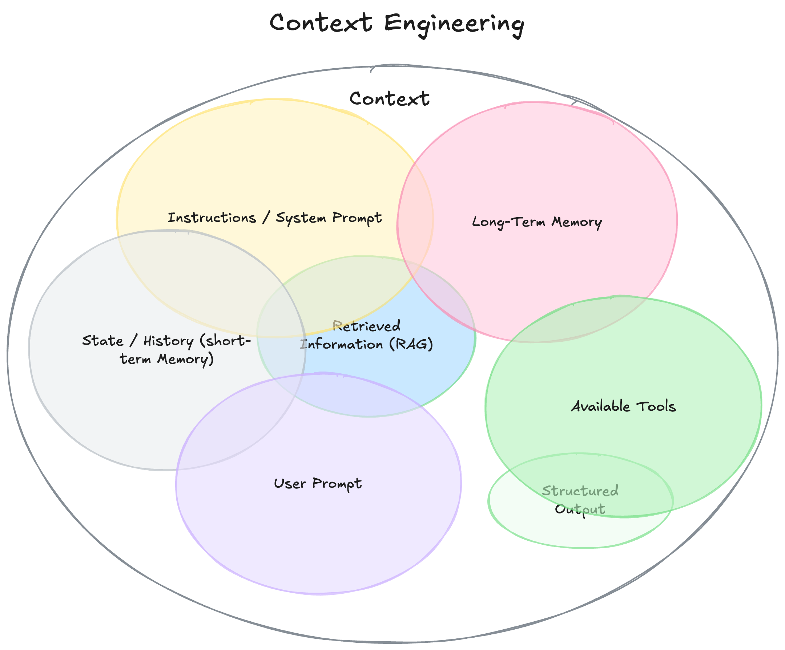
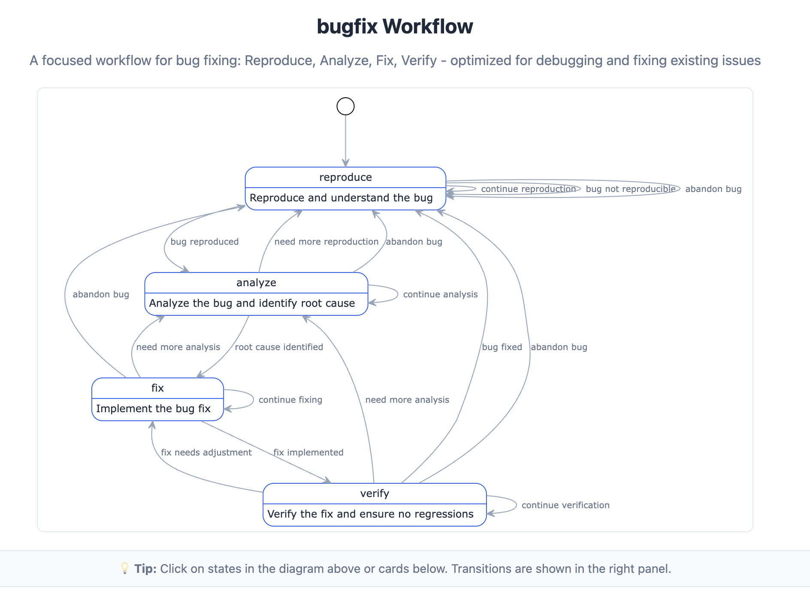

# There is no Secret Ingredient

GenAI wird immer noch wie Magie behandelt. Überall sehe ich Frameworks, die das "richtige" Prompting versprechen, Tools die den "optimalen" Kontext liefern wollen, und Methoden die das "Geheimnis" erfolgreicher KI-Entwicklung entschlüsseln sollen. 

Es erinnert mich an die Mystik des traditionellen Kung Fu: Geheime Techniken, die nur von Meister zu Schüler weitergegeben werden. Verborgenes Wissen, das Jahre der Meditation und des Trainings erfordert. Die Vorstellung, dass es irgendwo da draußen die eine perfekte Technik gibt, die alles verändert.

Während meiner Präsentation über Context Engineering hat mich das schon fast an Esoterik erinnert.

## Die Suche nach dem perfekten Framework

Wir alle kennen das: Die endlose Suche nach dem einen Tool, dem einen Ansatz, der endlich alles löst. Prompt Engineering Frameworks, die versprechen, das LLM perfekt zu steuern. RAG-Systeme, die den idealen Kontext liefern sollen. Agenten-Architekturen, die autonom die richtigen Entscheidungen treffen.

[Andere haben bereits aufgezeigt](https://www.philschmid.de/context-engineering), dass Kontext aus vielen Komponenten besteht - Conversation Memory, Documentation, RAG-Ergebnisse und so weiter. Mit responsible-vibe-mcp habe ich eine weitere Komponente hinzugefügt: **Process Memory** - das zielgerichtete Gedächtnis, das durch verschiedene Phasen eines Entwicklungsprozesses führt.

## Die Ernüchterung: Alles nur Zutaten

Aber bei aller Freude über das Neue gilt immer: All diese sophistizierten Tools - ob Conversation Memory, Process Memory, Documentation, Rule Files oder RAG-Ergebnisse - sie sind nur Zutaten. Sie alle haben nur einen Zweck: **Tokens in den Kontext zu bekommen**.

Das ist alles. Kein Geheimnis, keine Magie.
Rule-Files mit Konventionen? Statischer Kontext.
RAG durchsucht Dokumentation? Tokens on-demand in den Kontext. Ein Engineer wählt bestimmte Files aus? Tokens in den Kontext.

Bei aller (berechtigten 😉) Begeisterung über mein eigenes Tool: responsible-vibe-mcp orchestriert Workflows, hilft ein besseres Gespräch mit dem LLM zu führen und pflegt ein Prozessgedächtnis? Toll! ... Aber am Ende füttert es nur Tokens in den Kontext. 

Die ganze Sophistication, all die Tools und Frameworks - am Ende läuft alles darauf hinaus, die richtigen Informationen zur richtigen Zeit in das Kontextfenster zu bekommen.

Das klingt fast eher nach einer Kochanleitung – sind wir alle Köche? Oder doch eher Kung Fu Lehrlinge? Moooment, das lässt sich doch super kombinieren!

## Entwickeln ist wie Kung Fu – also fast

Ich liebe Kung Fu Panda (wer tut das nicht?) – und genau wie wir Entwickler sucht der vom Nudelsuppen-Koch zum Drachenkrieger werdenden Po lange Geheimnisse, um sein Kung Fu auf ein neues Level zu heben (oder erst mal anzuheben).

Im Laufe der Zeit erkennt er, dass es viel mit Training und Disziplin zu tun hat. 

Ich möchte jetzt nicht Software-Engineering mit Kung Fu gleich setzen, aber dass Training und Disziplin uns voran bringen würde wohl niemand bestreiten.

Vor Allem aber gilt: Die Entscheidungen machen den Unterschied!

- Wie wird die Conversation Memory kuratiert?
- Wann soll das LLM die Dokumentation einer Library lesen?
- Wann werden Testcases oder Testdaten bereitgestellt?
- Welche Quellen aus dem Long-term Memory sind relevant?

## Process Memory als Beispiel

Process Memory in [responsible-vibe-mcp](https://github.com/mrsimpson/responsible-vibe-mcp) ist ein perfektes Beispiel dafür. Es ist nicht magisch - es dokumentiert einfach Entscheidungen und Fortschritt durch verschiedene Entwicklungsphasen. Aber der Wert entsteht nicht durch das Tool selbst, sondern dadurch, dass der Engineer bewusst entscheidet:

- Wie beantworte ich die Rückfragen zur aktuellen Phase?
- Wann ist es Zeit, die Spezifikation abzuschließen und zu Design zu wechseln?
- Welche Entscheidungen treffe ich in der Planning-Phase und lege somit den Grundstein für die Implementierung?

Das Tool stellt nur die Infrastruktur bereit. Die intelligenten Entscheidungen trifft der Engineer.

## Die wahre "Geheime Zutat"

Po's große Erkenntnis war nicht, dass es kein Geheimnis gibt - sondern dass **er selbst** das Geheimnis ist. Seine Einzigartigkeit, seine Perspektive, seine Entscheidungen.

Genauso ist es mit Context Engineering. Die Tools sind wichtig, aber sie sind nur Werkzeuge. Die wahre "Geheime Zutat" ist der Engineer, der entscheidet:

- Welche Kontextquellen sind relevant?
- Wann soll welche Information eingebracht werden?
- Wie werden die verschiedenen Quellen orchestriert?
- Welche Entscheidungen werden dokumentiert und wie?

Der Kontext wird zu einem Abbild des Engineer's Denkprozesses. Und genau das macht den Unterschied zwischen mittelmäßiger und exzellenter KI-gestützter Entwicklung.

## Das Ende der Mystifizierung

Wenn wir aufhören, nach magischen Lösungen zu suchen, und anfangen, Context Engineering als das zu sehen was es ist - intelligente Entscheidungen über Informationsbereitstellung - dann können wir endlich die wirklich wichtigen Fragen stellen:

- Wie treffen wir bessere Entscheidungen über Kontext-Relevanz?
- Wie dokumentieren wir diese Entscheidungen für zukünftige Interaktionen?
- **Und vor allem: Was braucht eigentlich unsere Software?**

Das sind die Fähigkeiten, die Context Engineering ausmachen. Nicht die Tools, sondern die menschliche Intelligenz, die sie orchestriert.

---

Am Ende, wie Mr. Ping Po erklärt: "The Secret Ingredient is... nothing! To make something special, you just have to believe it's special."

Bei Context Engineering ist es genauso: Es gibt keinen geheimen Trick, keine magische Formel. Es ist nur der Engineer, der bewusste Entscheidungen über Kontext trifft und dabei seine Expertise und sein Urteilsvermögen einsetzt.

**It's just noodle soup.**
