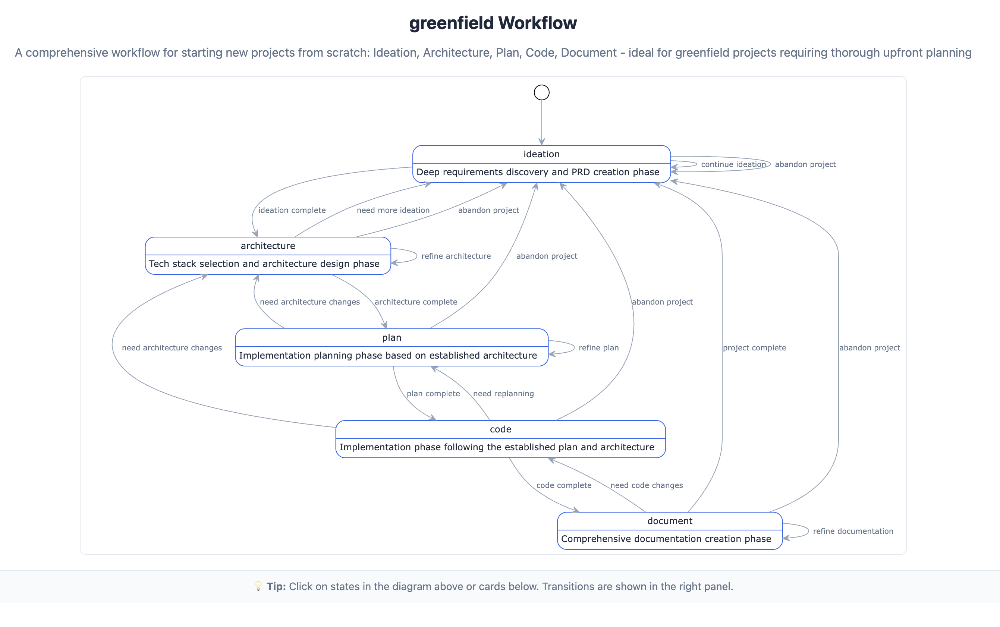
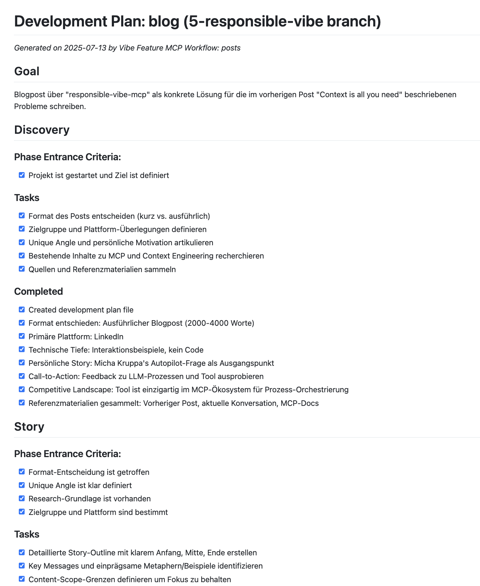
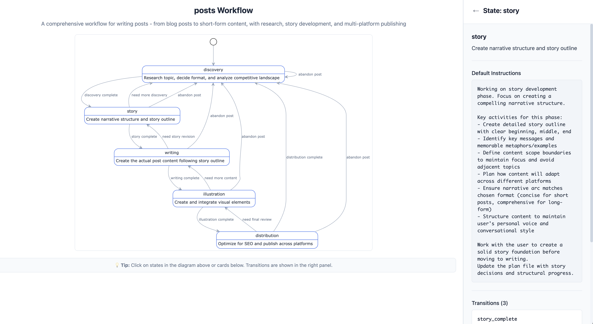
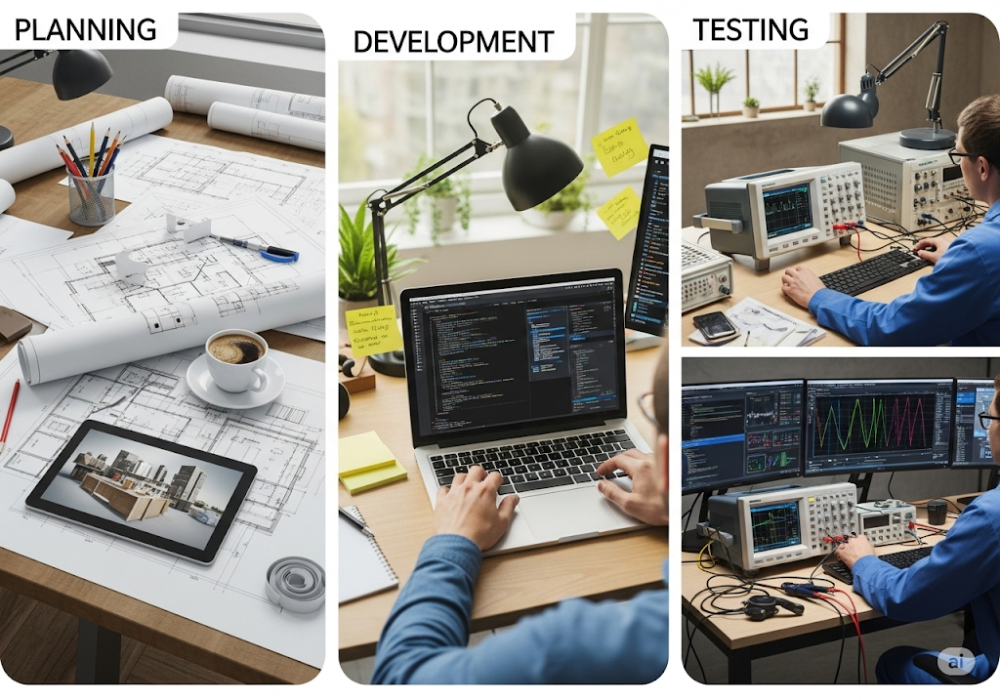

# Von der Autopilot-Frage zur Responsible Development

Mein geschätzter Freund Micha Kruppa stellte mir kürzlich eine provokante Frage: "Würdest du dich in ein Auto mit einem Vibe-coded Autopiloten setzen?" Mein spontaner Impuls war natürlich: "Nein!" 

Dann fragte ich mich aber: Würde ich mich denn in ein Auto mit einem von mir händisch entwickelten Autopiloten setzen? Die ehrliche Antwort: Ganz sicher auch nicht!

**Aber warum eigentlich nicht?** Es ging nicht um die Fähigkeiten - weder die des LLMs noch meine eigenen. Es ging um Vertrauen. Und Vertrauen in Software entsteht nicht durch die Brillanz des Entwicklers, sondern durch die Qualität des Entwicklungsprozesses. Ist dieser strukturiert, nachvollziehbar und enthält er sinnvolle Qualitätssicherungsmaßnahmen?

Wenn ich das so schreibe, komme ich mir selbst etwas fremd vor - ich bin eigentlich nicht besonders prozesstreu. Aber ich merke immer mehr, dass das Ergebnis viel besser wird, wenn man einem strukturierten Prozess folgt.

Das brachte mich zu einer fundamentalen Erkenntnis: Es ist nicht wichtig, WER die Software geschrieben hat - Mensch oder KI - sondern WIE sie entwickelt wurde.

## Das Problem: Brillanz ohne strategische Richtung

In meinem letzten Post "Context is all you need" habe ich beschrieben, wie Context Engineering die wichtigste Fähigkeit für KI-gestützte Softwareentwicklung wird. Die Kernherausforderung dabei: **LLMs sind außergewöhnlich kompetent und verfügen über mehr Wissen als jeder einzelne Entwickler. Aber ihnen fehlt das zielgerichtete Nach-Vorne-Denken.**

Sie sind perfekt darin, auf den aktuellen Kontext zu reagieren und hochwertige Lösungen für das unmittelbare Problem zu finden. Was ihnen fehlt, ist die strategische Sicht über mehrere Schritte hinweg - das "Wo wollen wir in drei Schritten stehen?" und "Welche Entscheidungen treffen wir jetzt, die uns später helfen?"

Verschiedene Ansätze haben versucht, diese Lücke zu schließen:
- **Mega-Prompts** mit detaillierten Schritt-für-Schritt-Anweisungen (werden schnell unübersichtlich und starr)
- **Agenten-Systeme** die automatisch den nächsten Schritt bestimmen (nehmen dem LLM die Flexibilität)
- **IDE-Integration** wo Entwickler manuell die Richtung vorgeben (überfordert uns Menschen bei komplexen Projekten)

Aber alle diese Ansätze haben ein gemeinsames Problem: Sie versuchen, das LLM zu kontrollieren oder zu ersetzen, statt seine Stärken intelligent zu orchestrieren.

## Die Erkenntnis: Engineering ist Entscheidungsdokumentation

Während ich über strukturierte Prozesse nachdachte, wurde mir noch etwas anderes klar: Prozessdokumentation ist nicht nur lästige Bürokratie - sie ist der Kern von Engineering. 

Im Rahmen eines Entwicklungsprozesses werden unzählige Entscheidungen getroffen, die die Lösung beeinflussen. Genau das ist Engineering: Das bewusste Treffen und Dokumentieren von Designentscheidungen. Und diese Entscheidungen müssen festgehalten werden - idealerweise als Teil des Repositories. Dann kann nämlich ein LLM darauf aufsetzen und auch in Zukunft kohärente Lösungen finden.

## Die erweiterte Erkenntnis: Qualität durch Prozess überall

Aber dann ging mir noch etwas auf: Diese Erkenntnis über Qualität durch strukturierte Prozesse beschränkt sich nicht nur auf Software-Engineering. **Jeder digitale Arbeitsprozess profitiert von dieser Herangehensweise.**

Das Schreiben dieses LinkedIn-Posts ist das perfekte Beispiel: Statt einfach drauflos zu schreiben, folgen wir einem strukturierten Prozess - Discovery (Thema klären), Story (Narrative entwickeln), Writing (Content erstellen), Illustration (Visuals hinzufügen), Distribution (Optimieren und veröffentlichen). Das Ergebnis ist fokussierter, konsistenter und qualitativ hochwertiger.

Dasselbe gilt für Präsentationen, Dokumentationen, Projektplanungen - überall wo komplexe, mehrstufige Arbeit geleistet wird, sorgt ein strukturierter Prozess für bessere Ergebnisse.

## Die Lösung: Responsible Vibe MCP - Ein Prozess für jeden Kontext

Aus diesen Erkenntnissen heraus habe ich "responsible-vibe-mcp" entwickelt - einen Model Context Protocol (MCP) Server, der als intelligenter Konversations-Orchestrator für verschiedenste Arbeitsprozesse fungiert.

**Was macht ihn besonders flexibel?**

Das System erkennt, dass verschiedene Aufgaben völlig unterschiedliche Prozesse brauchen:

- **Greenfield-Projekte**: Ideation → Architecture → Plan → Code → Document  
  *Für neue Projekte, die gründliche Vorplanung brauchen*

- **Feature-Entwicklung (EPCC)**: Explore → Plan → Code → Commit  
  *Für kleinere Features und iterative Entwicklung*

- **Bug-Fixing**: Reproduce → Analyze → Fix → Verify  
  *Fokussiert auf Debugging und Problemlösung*

- **Minor Changes**: Explore → Implement  
  *Streamlined für kleine Änderungen*

- **Content Creation**: Discovery → Story → Writing → Illustration → Distribution  
  *Für Blogposts, Präsentationen, Dokumentationen*

**Das Geniale:** Das LLM bekommt nicht nur strategische Richtung, sondern den **richtigen Prozess für die jeweilige Aufgabe**. Ein Bugfix braucht andere Schritte als ein Greenfield-Projekt, und das System passt sich automatisch an.

Schauen wir uns den Unterschied an: Ein **Greenfield-Projekt** durchläuft die Phasen Ideation → Architecture → Plan → Code → Document, weil bei neuen Projekten gründliche Vorplanung entscheidend ist:

Ein **Bugfix** hingegen folgt einem völlig anderen Muster: Reproduce → Analyze → Fix → Verify - fokussiert und zielgerichtet auf die Problemlösung:

**Wie funktioniert das konkret?** Das LLM ruft nach jeder Benutzerinteraktion automatisch `whats_next()` auf und erhält phasenspezifische Anweisungen. Das ist also so etwas wie "phasenspezifisches Prompt-Engineering".

Hier sehen wir das System in Aktion - es erkennt automatisch, wann eine Phase abgeschlossen ist und leitet mit einem spezifischen Prompt zur nächsten über:

Über den Plan, der dabei übermittelt wird, wird der Kontext gefüttert und kontinuierlich erweitert.

Das LLM behält seine volle kreative Flexibilität, bekommt aber die strategische Orientierung, die ihm normalerweise fehlt.

## Meta-Beweis: Diese Konversation selbst

Das Schöne ist: Diese Konversation hier ist der lebende Beweis für die Funktionsweise. Während wir diesen Blogpost entwickeln, orchestriert das System unseren Entwicklungsprozess und dokumentiert ihn automatisch:

Diese Dokumentation ist nicht nur für Menschen wertvoll - sie ermöglicht es auch zukünftigen LLM-Interaktionen, kohärent an diesem Projekt weiterzuarbeiten, ohne den Kontext zu verlieren.

## Warum das funktioniert

**Strategische Führung ohne Mikromanagement**: Das LLM bekommt klare Richtung für den nächsten Schritt, behält aber seine Kreativität und Problemlösungskompetenz.

**Kontextspezifische Prozesse**: Jede Aufgabe bekommt den Workflow, der zu ihr passt - von schnellen Bugfixes bis zu umfassenden Greenfield-Projekten.

**Phasenspezifischer Kontext**: Statt alles gleichzeitig zu laden, bekommt das LLM nur die für die aktuelle Phase relevanten Informationen und Tools.

**Prozess-Gedächtnis**: Die Markdown-Datei fungiert als persistenter Speicher für Entscheidungen und Fortschritt - das LLM muss nicht alles im Kopf behalten.

**Intelligente Orchestrierung**: Das System erkennt automatisch, wann eine Phase abgeschlossen ist und leitet zur nächsten über, ohne die natürliche Konversation zu unterbrechen.

**Benutzerfreundlichkeit**: Der Entwickler arbeitet ganz normal mit dem LLM - die Prozess-Orchestrierung passiert unsichtbar im Hintergrund.

## Responsible Development in der Praxis

Was bedeutet das für die tägliche Arbeit? 

**Für Menschen**: Wir können uns auf die kreativen und strategischen Aspekte konzentrieren, während das System die Prozess-Compliance und Dokumentation sicherstellt.

**Für LLMs**: Sie bekommen die strategische Orientierung und den strukturierten Kontext, den sie brauchen, um ihre enormen Fähigkeiten optimal einzusetzen.

**Für Teams**: Entwicklungsentscheidungen werden automatisch dokumentiert und sind für alle nachvollziehbar - menschliche wie künstliche Teammitglieder.

**Für verschiedene Arbeitstypen**: Ob Software-Entwicklung, Content-Creation oder Präsentationen - jeder Prozess bekommt die Struktur, die er braucht.

**Für die Zukunft**: Projekte werden "LLM-ready" - neue Teammitglieder können sofort produktiv werden, weil der gesamte Entscheidungskontext verfügbar ist.

## Der Paradigmenwechsel

Wir stehen vor einem Paradigmenwechsel in der digitalen Arbeit. Die Frage ist nicht mehr "Mensch oder KI?", sondern "Wie schaffen wir Prozesse, die das Beste aus beiden Welten herausholen?"

Responsible Development bedeutet:
- **Strategische Führung statt Kontrolle**: LLMs bekommen Richtung, behalten aber ihre Flexibilität
- **Kontextspezifische Prozesse**: Der richtige Workflow für jede Aufgabe
- **Dokumentation als Nebenprodukt**: Entscheidungen werden automatisch festgehalten, ohne zusätzlichen Aufwand
- **Kontinuierliche Verbesserung**: Prozesse lernen aus jedem Projekt dazu und werden intelligenter

## Fazit: Vertrauen durch intelligente Orchestrierung

Zurück zu Micha's ursprünglicher Frage: Würde ich mich in ein Auto mit einem responsible-vibe-orchestrierten Autopiloten setzen? Wenn der Entwicklungsprozess transparent, nachvollziehbar und gut dokumentiert ist - definitiv eher als in eines mit unstrukturiert entwickelter Software, egal von wem sie stammt.

Die Zukunft der digitalen Arbeit liegt nicht in der Konkurrenz zwischen Mensch und KI, sondern in der intelligenten Orchestrierung beider durch strukturierte, verantwortungsvolle Prozesse, die die Stärken beider Seiten optimal nutzen.

---

**Wie orchestriert ihr eure LLM-Arbeitsprozesse? Welche Erfahrungen habt ihr mit strukturierten vs. unstrukturierten KI-Interaktionen gemacht?**

**Wer Lust hat, responsible-vibe-mcp auszuprobieren:** [GitHub Repository](https://github.com/mrsimpson/vibe-feature-mcp) - Feedback und Erfahrungsberichte sind sehr willkommen!
